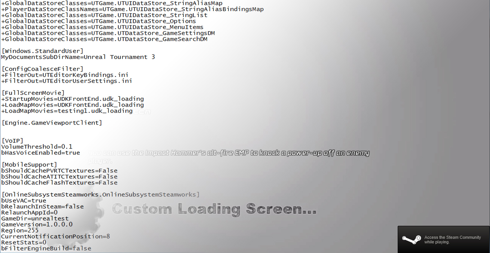

This is a simple addition but will help the overall look of the game and add to it's polish. I have just tested adding a load screen to the game, this can implemented easily with by converting the intended video to a .bik and then moving it into Movies directory. Editing the config file allows for a random loading screen each time. This will be useful but I also need to look into changing the text as well which will likely be within the game type class.

This is a brief look at the loading screen, the artwork is not final of course:

<iframe width="560" height="315" src="https://www.youtube.com/embed/uGXSVr-eQMI" frameborder="0" allow="accelerometer; autoplay; encrypted-media; gyroscope; picture-in-picture" allowfullscreen></iframe>
