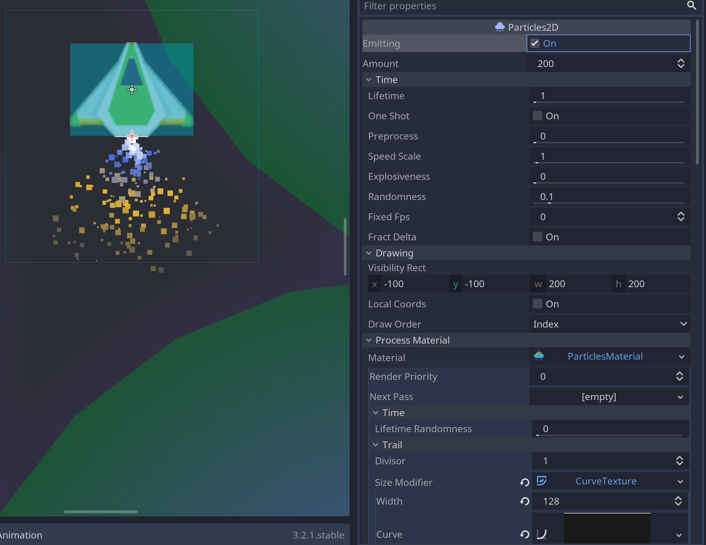

I discovered Godot a few months ago and I really like it so far. It's a game engine that's easy to use and feature packed.

If you want to see some code, take a look at [the protoype](#making-a-2d-prototype-in-godot) below and how it was done.


## What is Godot?

Godot is a free and open-source game engine. I've tried some other open source game engines int he past but Godot is the most polished and fully-fledged engine I've used.

## Why choose Godot?

Godot has everything you need to get going and is easy to start. That's why I decided to play around with it instead of Unity or Unreal. I have nothing against Unity and Unreal, they are great engines but they also come with a lot of capabilities that I never used. Unreal in particular has a lot of features that are aimed at first-person shooters because that's what it was initially built for. When you try to do anything else, you're going against the grain. Godot, however, is sharp. It's easy to use, it doesn't put up any barriers.

## How is it different to Unity?

Unity was my go-to engine becuase it's flexible and easy to use. I like Unreal but it's not suited for my needs most of the time. It's powerful but takes a lot of work to prototype. Godot and Unity and are similiar to use, the first difference that makes Godot stand out is size.

### Lightweight

Godot is less than 30MB to download. It has a small memory footprint too. Compared with the others, it's lightweight and sharp. There's isn't a massive multi-gigabyte download, there isn't even an install. Just download the executable and you're good to go on Windows, Mac or Linux.

### Everything is a Node

Unity uses a combination of objects and components. A basic game object can contain different components like physics, materials, scripts, etc. And then you can combine mutliple objects into prefabs so they can be reused throughout your game. Godot does it a little differntly. Everything is a node. Nodes can contain other nodes and you create trees of nodes. Even a game level is just a node that has everything in your level as its children. The one exception is scripts which you attach to any node.

Godot's approach takes a little while to get used to but it has a few benefits. Dealing with level streaming can be as simple as importing a tree of nodes. You don't need to add tags to every object as a way to find things in the scene, you can structure your tree in a way that makes sense. Lastly, it's easy to see what your game logic is doing in the hierarchy of your level. In Unity you can see when objects spawn but in Godot, watching nodes be added can mean audio, texture, physics nodes are being added and removed. It makes for a very flexible system that's fun to use and easy to hack together.

### GDScript, C#, C++ or visual scripting

Godot gives you options for coding, you can get away with GDScript, a python like language that makes game logic a dream.

- Use **C#** if you're coming from Unity or XNA/MonoGame and want a familiar and powerful language.
- Use **C++** if you want to get down into the nitty gritty of the engine and write very performant code.
- **Visual scripting** is great for level logic and I use it for shaders too.
- There are also community supported languages if you don't find something you like, one of them is **Python**!

<div id="making-a-2d-prototype-in-godot"></div>

## Making a 2D prototype in Godot

<video width="100%" height="340" controls autoplay loop muted>
	<source src="keep-it-alive.mp4" type="video/mp4">
</video>

_The asteroids pulling the ship towards them with gravitational force whenever the ship is in the purple area_

I decided to jump in and give Godot a try, I've tinkered with the engine over the past few weeks but this time I decided to make a prototype over a couple of hours. Something that proves a concept, it's a basic asteroids like ship with planets that have gravitational pull.

### Ship movement


The first piece of code we need is something to control our ship. To get a ship-like feel, we apply some force when the up action is pressed (set in the input manager as the 'W' key). Then left and right control our rotation. That's it. It's not perfect and could defintiely use some tweaking to get the right feel but for a quick prototype, it's fine for now.

```gdscript
extends RigidBody2D

var thrust = Vector2(0, -1000)
var torque = 20000

func _integrate_forces(state):
	if Input.is_action_pressed("up"):
		applied_force = thrust.rotated(rotation)
	else:
		applied_force = Vector2()
	var rotation_dir = 0
	if Input.is_action_pressed("right"):
		rotation_dir += 4
	if Input.is_action_pressed("left"):
		rotation_dir -= 4

	applied_torque = rotation_dir * torque
```

_Movement is pretty simple_


We also need to make a few adjustments to the physics, by default the physics direction points downwards so our ship is going to fall. We'll remove this to simulate zero-gravity. This ensures only the player and the asteroids with gravity, affect the ship.

### Let's make the planets (asteroids in this case) rotate


Giving the asteroids rotation was simnple, I just added a script to the node to rotate a little bit every frame. Using GDScript, the code compact and easy to read.

```gdscript
extends StaticBody2D

func _process(delta):
	rotation += delta * 0.05
```

_Rotating the planet is as easy as this simple script_

### Adding a particle emitter for the thruster



To give the ship morse sense of movement, I added a particle emitter. It's not pretty but it does give a better sense of movement than without it.

```gdscript
extends Particles2D

func _process(delta):
	if Input.is_action_pressed("up"):
		emitting = true
	else:
		emitting = false
```

_Again, turning the emitter on and off is another short script_

There you have it. This was my first time making something even remotely resembling a game in the past few years. There is something about Godot that makes it appealing enough for me to tinker with it in my free time. It reminds me of when I would make stupid prototypes in GameMaker when I was a teenager.

_Thank [https://kenney.nl/](https://kenney.nl/) for the assets I used here, they are free to use and are my go to for prototyping ideas._
