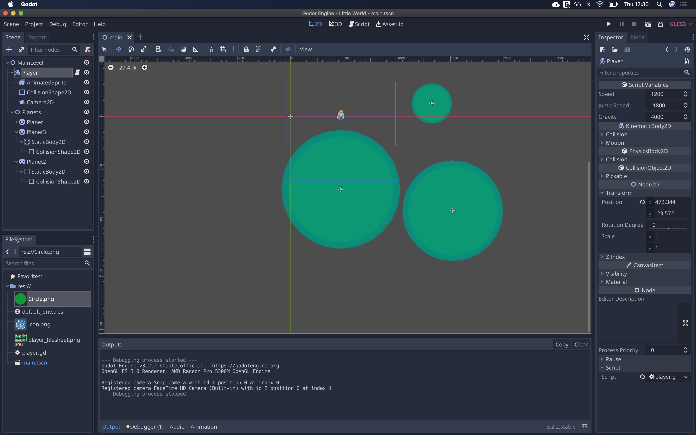
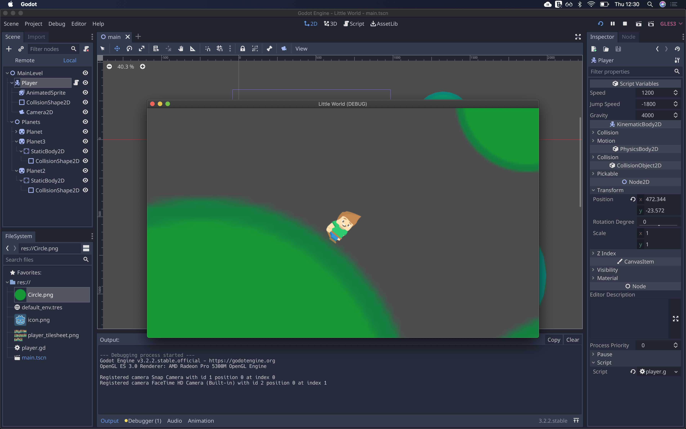
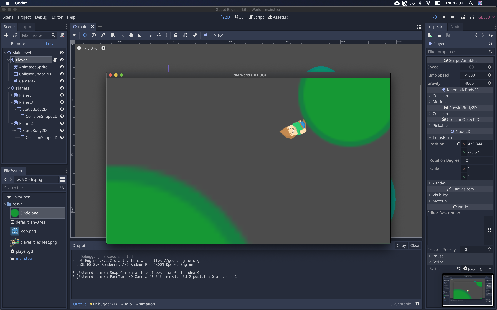

I've been playing around with [Godot 3.2](https://godotengine.org/) recently, my favourite little game engine. I've had a lot of time recently to just have fun and experiment so I decided to try and replicate a mechanic that I loved in platforming games, in particular Mario Galaxy. The way the player can navigate around 3D objects and jump between them is quite appealing and I haven't seen it done in many games before or afterwards. So I did it in 2D with Godot.

<video width="100%" height="340" controls autoplay loop muted>
    <source src="world.mov" type="video/mov">
	<source src="world.mp4" type="video/mp4">
</video>

## What is this?

The goal is to create a rough prototype to try and replicate a core mechanic of Mario Galaxy, the movement between different planets. This is a simple experiment and is very rough around the edges.

## How does it work?



The main components are the player character and some planets comprised of `Static2DBody` nodes.

### Snapping to the planet

I followed this guide, [KinematicBody2D: align with surface](http://kidscancode.org/godot_recipes/2d/2d_align_surface/) to get the basic navigation working. The idea is to rotate the player towards the last object they 'landed' on. This gives a pretty good effect and works for the most part.

The only issue is that navigating between planets is cumbersome. It's only really possible if you can jump to the planet and land feet first. What I want is to allow the player to navigate between gravitational bodies by jumping closer to them. This allows for the player to jump between planets more easily and opens the gameplay up for more possibilities.

### Movement

To get the movement I wanted, some changes needed to take place. The player, instead of falling towards the last landed-on surface, should fall towards the center of the planet.

We do this with the following lines, setting the rotation towards the current planet.

```gdscript
var gravity_dir = current_planet.global_transform.origin - global_transform.origin
	rotation = gravity_dir.angle() - PI/2
```

To make it easier to calculate the closest planet, I added all planets as child of a node. For our prototype, we simply get the children. Next we have to figure out which planet is closest.



```gdscript
planets = get_node("/root/MainLevel/Planets").get_children()
```

Our naive implementation looks like this:

```gdscript

func _get_closest_planet(smallest):
	var new_smallest = smallest
	var did_change = false

	if !is_jumping:
		return

	for planet in planets:
		if !new_smallest:
			new_smallest = planet

		if global_position.distance_to(planet.global_position) < global_position.distance_to(new_smallest.global_position):
			new_smallest = planet

	if new_smallest != current_planet:
		is_jumping = false
		velocity.y = 1200

	current_planet = new_smallest
```



We find the closest planet and if it's changed, we make sure the player is no longer jumping and try and force them towards that planet. This ensures the rotation doesn't snap to a new planet halfway through a jump.

There you have it, a very crude but workable experiment with some GDScript and hackery.

## Source Code

See the source code for this example at [godot-game-experiments by Darth-Knoppix](https://github.com/Darth-Knoppix/godot-game-experiments) in **Little World**.

## References:

- The basis of the movement can be found at [Godot Recipes](http://kidscancode.org/godot_recipes/2d/2d_align_surface/)
- I used one of the [platformer characters from Kenney](https://kenney.nl/assets/platformer-characters)
