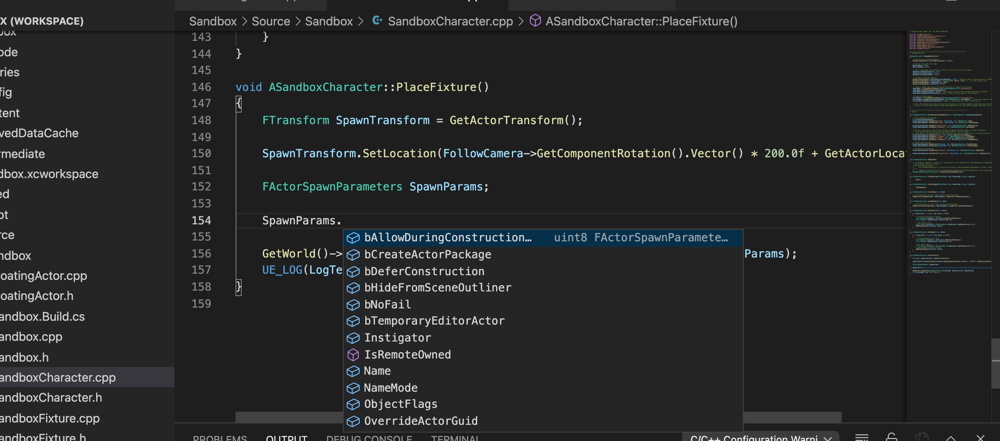
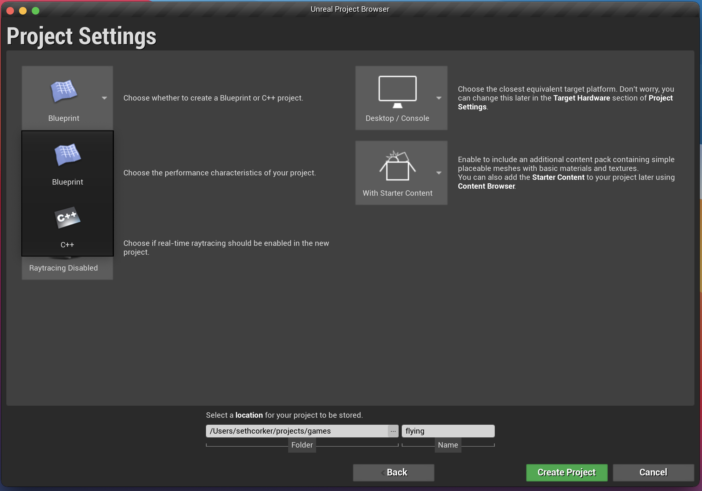
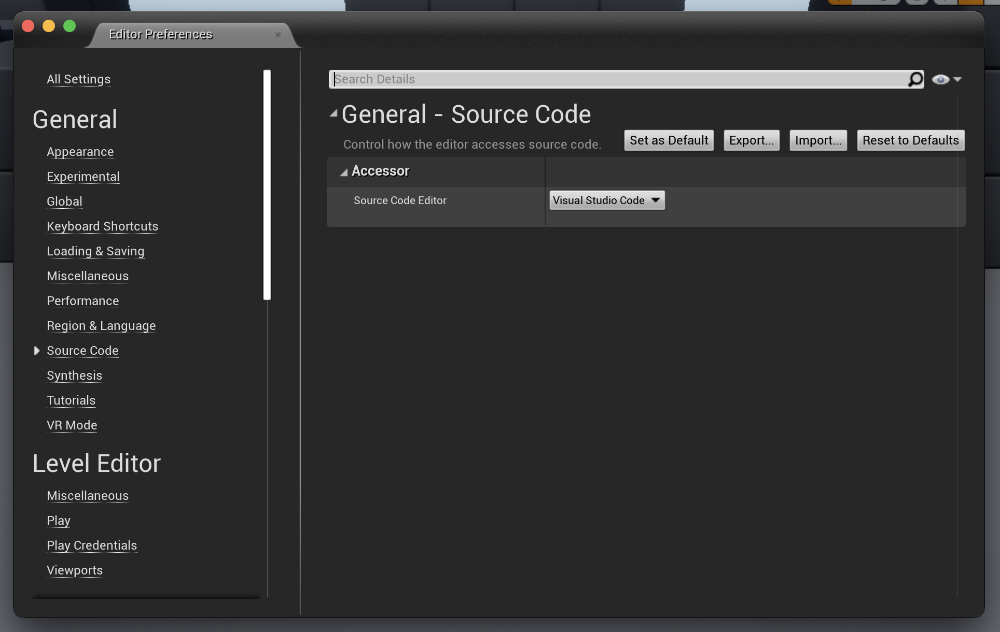
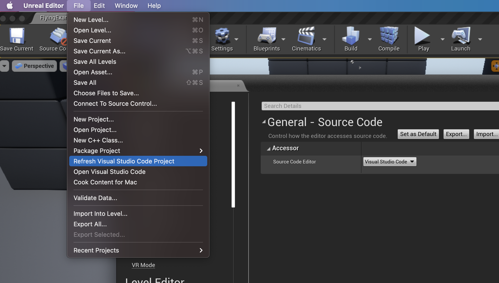

Mac is a popular patform for developers of web apps, server applications etc. but it's not so common for video game development. Windows is still the the most popular operating system for Unreal Engine 4 development and it shows, most tutorials you'll see, documentation and resources default to Windows. So how do we get a good development experience on Mac in UE4 with C++?

I use a Mac day to day for work and recently got rid of my Windows machine as it just wasn't getting used. My only regret is that there are far more hoops to jump through for getting Unreal Engine working (especially if you've got a shiny new M1). Here's my setup that I've found to be pretty good so far.

## Use Visual Stuido Code instead of XCode

I tried getting Xcode working with Unreal Engine 4.26 but I kept running into the same issue. Indexing. XCode will try and index the C++ project which will take forever, I don't know how long exactly because I gave up after 4 hours. Why does it matter? Indexing allows the editor features you'd expect to have access to like autocompletion, linting etc. Without indexing, the project will do syntax highlighting but jump to defintion is doesn't work, autocomplete is lackluster and in the end you're better off just using a text editor with syntax highlighting for all the help it gives you.

### Autocomplete

After hours of frustration, I decided to setup VScode instead. It's what I use as a web developer so why not repurpose it for C++ too! The end result looks like this, glorious autocomplete, which someone who's not familiar with the ins and outs of UE4 and C++; autcomplete is a huge helper.

### A new C++ project

The first step is to make a new project or change an esisting one, since the whole premis of this is setting up our project to work with VSCode you'll want to choose a C++ project.

### Setting the default Source Editor

Once you've got a project to work with, open the preferences and go to **General -> Source Code**, You'll see the `Source Code Editor` prop, which by default is set to XCode on MacOS. Change it to VS Code (make sure you've got it installed on your system otherwise this option may not come up).

### Generating VS COde project files

Now that VS Code is the default editor, let's generate the project files which will give VSCode some more context on how the work with our Unreal Engine project. You'll see something along the lines of **Create Visual Studio Code Project** or **Refresh Visual Studio Code Project** if it's already setup.

### Editing your project in VS Code

Once this is complete, we can choose to **Open Visual Studio Code** from the file menu whenever we like, opening a single source file should also open it in VS Code by default. There are a few extensions you'll be asked to install to complete the setup in VS Code like the mono framework, a C++ extension etc. Once it's all doen, your project source files should be visible and autocomplete should start working in a few minutes. It's a much smoother experience than XCode and getting up and running is faster.

I hope this helps point you in the right direction if you're having trouble getting a good developer experience with Unreal Engine and C++.