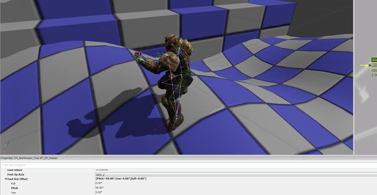
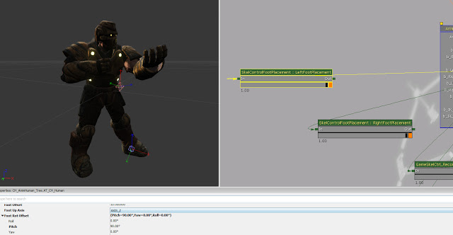
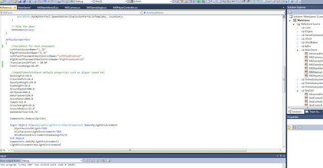

I have just implemented better foot placement using IK with Unrealscript. It uses code from UDN: [http://udn.epicgames.com/Three/UsingSkeletalControllers.html](http://udn.epicgames.com/Three/UsingSkeletalControllers.html)  
This provides better foot placement than default so the player mesh actually reacts to the varying surfaces rather than just floating across. Although it is not perfect I believe it is an improvement.

After tweaking the values I have come up with something that looks normal I have not yet however managed to get it working well with player movement. For now it works well when the player is standing still - movement resulted in too much uncertainty and would have ultimately lead to more problems.

Here is an example of it in action:

<iframe width="560" height="315" src="https://www.youtube.com/embed/YlFC-WMqBVs" frameborder="0" allow="accelerometer; autoplay; encrypted-media; gyroscope; picture-in-picture" allowfullscreen></iframe>
