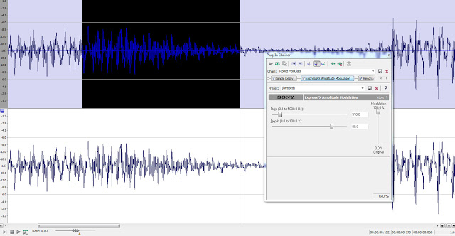

I am in the process of some sound creation and editing. I have begun with some simple recordings that have been modified using Sony Sound Forge. I have created a chain of plugins which I can then apply to other recordings to give the same effect. Sound Forge has been the most useful utility for editing sound so far but I will only be using it for SFX and vocals, music will be done in something else.

The sounds I am creating are for the main character and thus need to sound robotic.They will provide indications of the players status such as they are taking damage, falling etc. I will have to record some variations of more common sounds so the player does not keep hearing the same sounds repetitively. Things like indicating the player is taking damage can happen very often so multiple sounds will be created and using sound cues in UDK.

Here is a sample of one of the sounds which has been created:  
[http://dl.dropbox.com/u/34088562/SystemsOffline.wav](http://dl.dropbox.com/u/34088562/SystemsOffline.wav)
