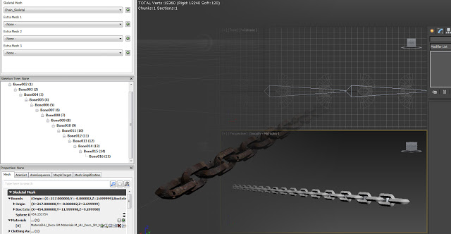
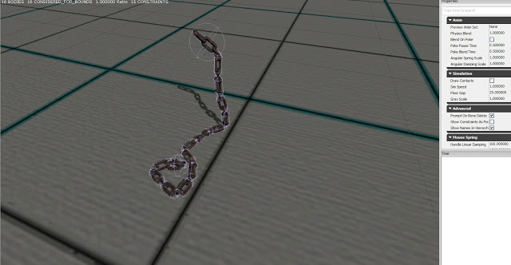

A key component of the Assembly Line level is a chain which robots will be hanging from. In order to make it more interesting I decided to make a skeletal mesh so it could be interacted with in the level. I was able to use 3DS Max array tool to quickly make the chain model and then skin it and add bones.

This is the Physics asset created in UDK, it can swing around in the level realistically and will be used in conjunction with other physics assets such as a robot. I will integrate meany of these into the final levels.
