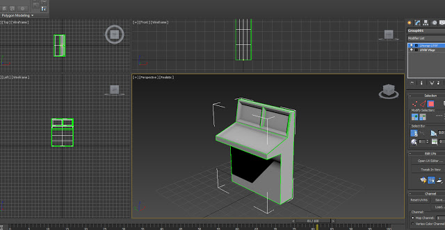
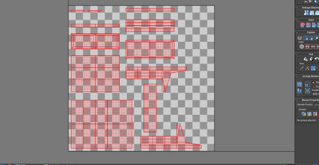
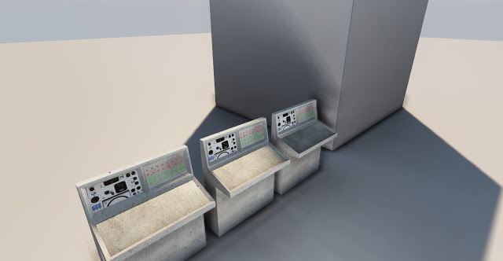

I have begun modelling static meshes for existing and yet to be made levels. This is the first time I have used Autodesk 3DS Max since the 2008 version so I am starting off with more simple meshes, eventually I will move towards more complex modelling such as the main character. The modelling tools have improved and the Static Mesh workflow is made much easier with newer versions of UDK, this allows for rapid iteration and testing.

The UV set for the simple console mesh. From here the UV map is rendered and saved as an image file, I can then edit it in Photoshop and thus create the texture.

The model was imported into UDK with LOD(Level of Detail) groups, a basic material has been applied for proof of concept. The materials will be improved later once a master material is created in which to derive them from.
