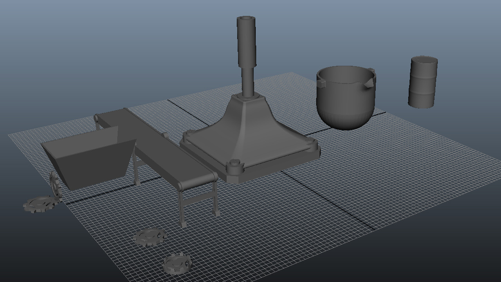

I am practising 3D modelling with a few basic assets in Autodesk Maya.

The theme for these are a factory, these are some useful meshes which can be reused in an environment such as the interior of a factory. I will alter the UVs so that materials can be applied for use in the engine.
