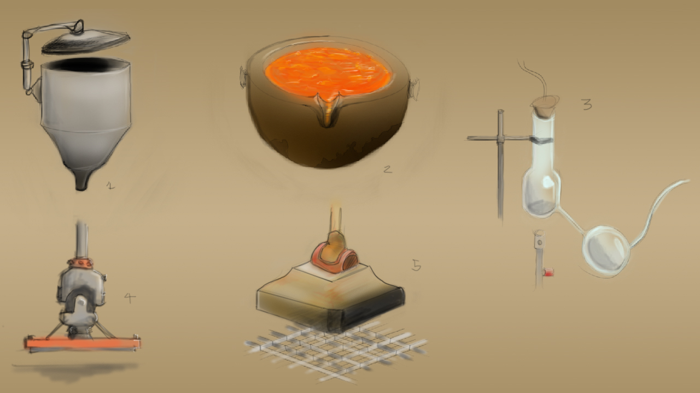

_This material was created while at the Victoria University of Wellington for a media design class._

The brief was to be given an object from another person in the class and through a series of articulators, manipulate the object into something else before passing it on to another person.

These quick sketches are what I used to mock up the designs for what I would model.

