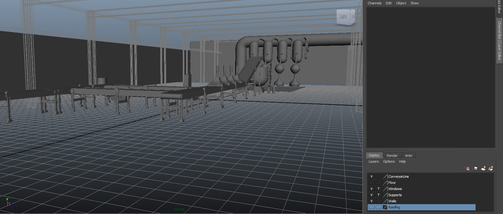
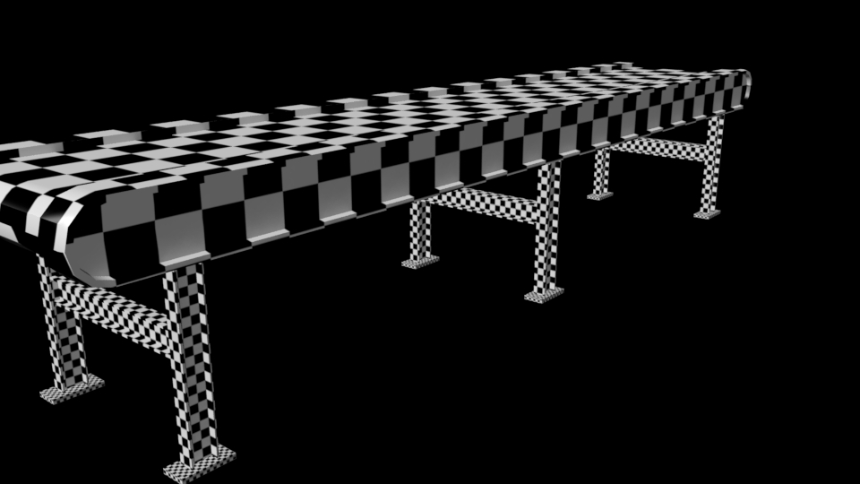

_This material was created while at the Victoria University of Wellington for a media design class._

Once all my models had been created I decided to create the scene which would be used in the animation I was making.

When it came to rendering however I realised that I needed to unwrap my UVs so that materials would look correct on when applied to the model. This had to be done for all objects in the scene and is a very long process. What made it more difficult is I had to replace the object in my scene with the newly updated meshes. It is a good  lesson that the model should completely finished before making the scene or a reference which is close enough to the final mesh should be used in place.

