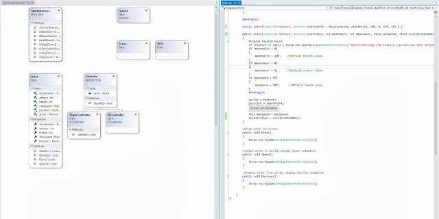

Learning from my project using UnrealScript I have begun working on laying out an engine framework which I can then build my game on top of. By abstracting out certain elements I hope to allow for rapid prototyping, rapid creation and more flexibility in subsequent XNA game projects. By creating an engine I can create different games with similar game-play mechanics.

This project will be focused towards a retro style ship shooter. I will develop gameplay mechanics in stages in order to differentiate itself and see how far I can push it. Although it will be structured toward this retro shooter gametype, many high-level components will be reusable in other projects.

An example of a class in my engine is the 'Actor' class, this represents any object that can be seen on the screen such as the player, an enemy etc. This will save time when creating more complicated systems comprised of spawning multiple enemies of different types on the screen, the main objective is to minimize repetition in code. This class is very high-level and with minor changes it can be used in conjunction with other gametypes.
