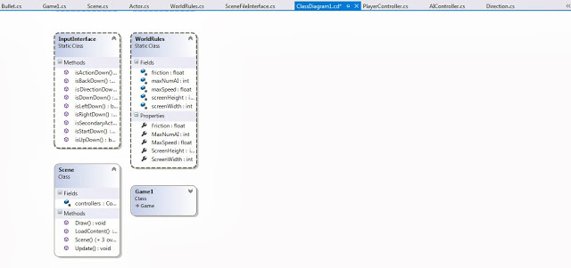

Although in the very early stages, I have been focusing on making a framework where I can make changes easily to create different game types. I may try to make a few different games using this framework. The first stages will be replicating a style of game and then I will add gameplay enhancements and new game mechanics.

Obviously the graphics are terrible at this early stage because that will be a focus later on in development unless it proves a specific principal.

I have made a couple of classes which I call InputInterface and WorldRules. This allows for a couple of things to be simplified and abstracted. The InputInterface means that input is handled by this wrapper so it will work easily with a controller or keyboard; this reduces number of lines and is more intuitive when writing code. The WorldRules class is used to store variables which have impact on the game itself, for this game I have things like number of enemies which will be on screen before allowing more to spawn as well as physics properties like friction. I can change these all in one place rather than looking throughout the entire catalog of classes in the game.
