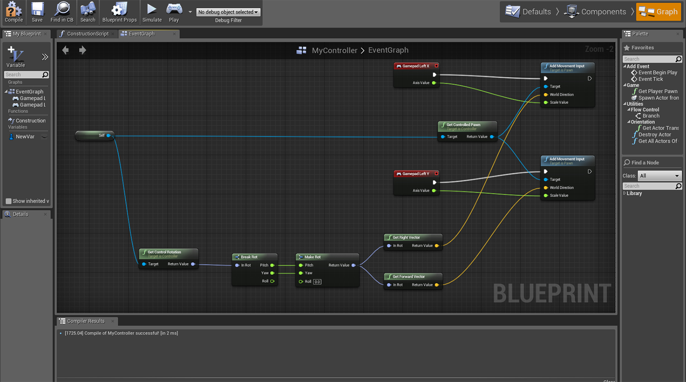
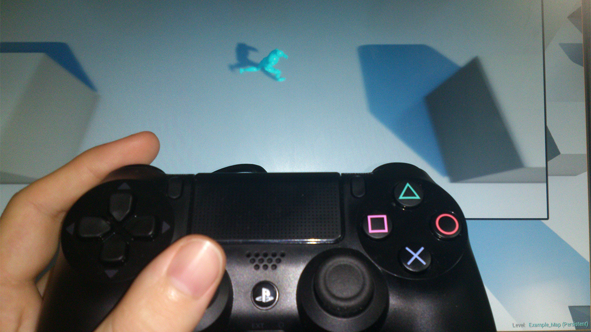

I jumped into UE4 and tried to reacquaint myself with the engine, it is familiar but different. The most noticeable addition is a re-haul of the Kismet visual scripting system. It has been replaced with blueprints which are much more flexible and powerful.

I setup a quick blueprint to handle player movement along with a basic top down template. I am controlling the character using the PlayStation 4 controller (DualShock 4).

It took me a little while to get used to the new system however I think it is a great system which allows much more to be done in the editor.
