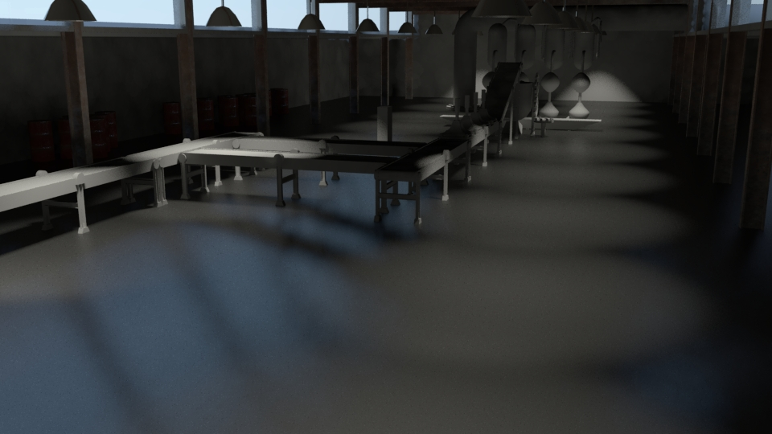
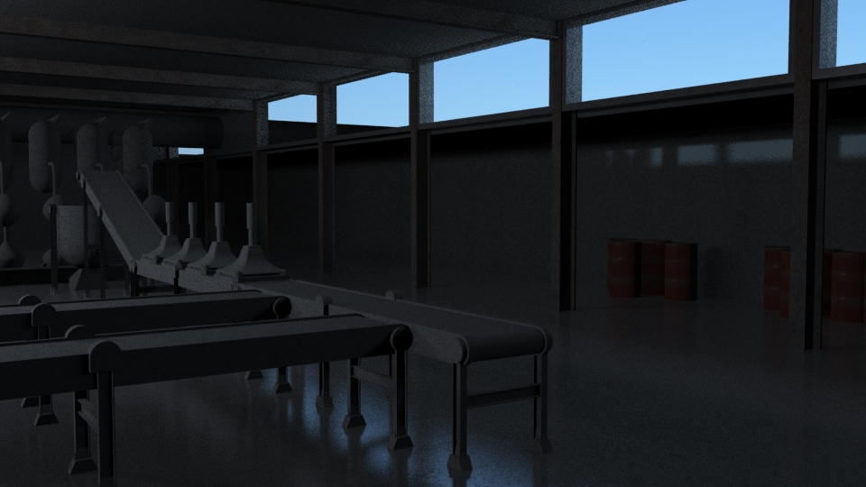
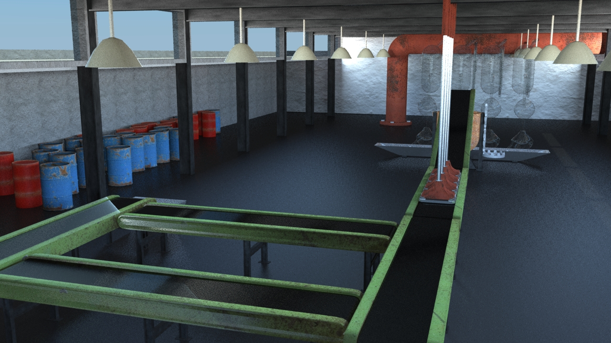
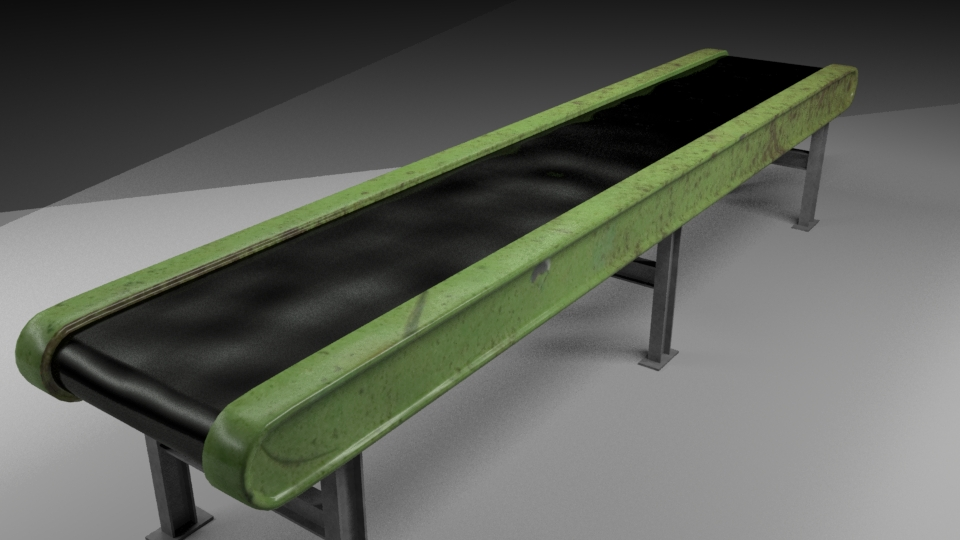
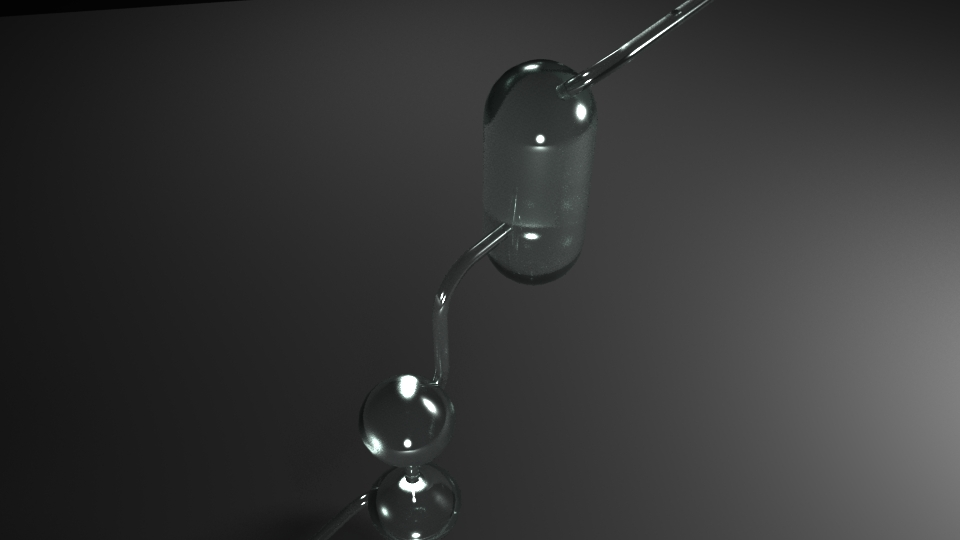
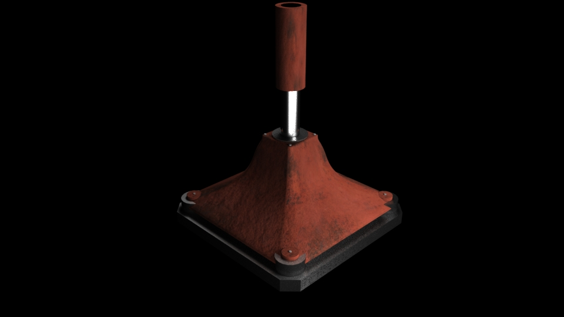
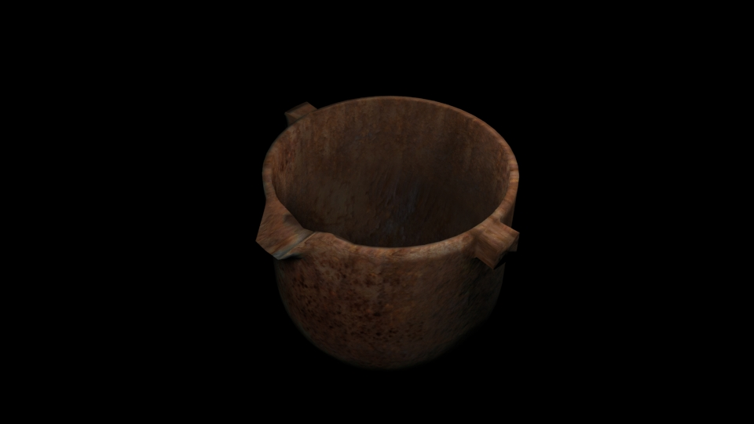
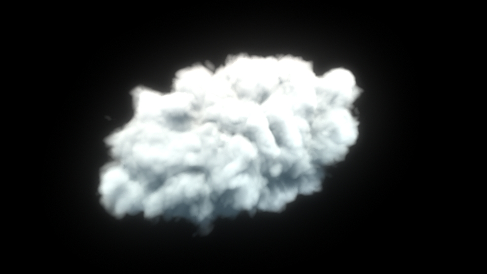

_This material was created while at the Victoria University of Wellington for a media design class._

Before I updated my meshes, I decided to do a lighting test to get a better idea of how the final product may look.

With all of the models created, UV unwrapped, materials applied and the scene light - these are the final renders.

Before the scene was re-rendered, I rendered out each mesh individually to make sure they were what I wanted for the final render.

This glass apparatus is my favorite render, MentalRay does a really nice job of rendering realistic materials such as glass very easily.

