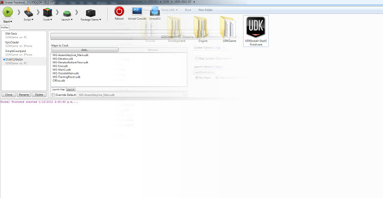
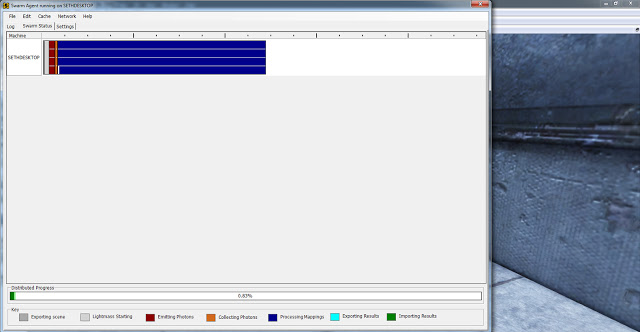
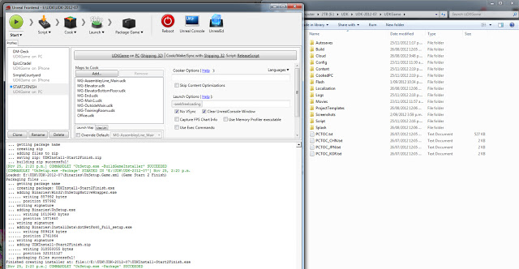

I have finished the small demo I set out to make at the beginning of the year. It has been handed in with more in depth documentation which is not on the blog. This has been a valuable experience; seeing something grow and evolve to a finished product. Although the demo has been made, the blog is not finished. At the beginning of 2013 I will look into extending the blog into either another project which will use what I have learned to produce a much better outcome or even a tutorial series to help others out with Game Development and the Unreal Development Kit.

In order to fulfill the requirements set out by my initial planning, the game demo had to be packaged and distributed so that it can be playable without the editor. To do this in UDK it has to be 'Cooked' which is the process of compiling and optimizing code, maps and data for a target platform. This is done using Unreal Frontend to build for PC.

Before the game could be packaged I needed to add the final touches, this meant implementing the loading screen, splash screen and credits. In order to make a standalone game I also had to a few configuration files .ini files to change the default starting map and UI. Once this was changed the game was able to start as intended.

I rebuilt the lighting in every level before cooking. When testing out levels I only used medium lighting quality to reduce build time of Lightmass however for the final product I had to build with Production Lighting. This process took a huge amount of time because I am using a single gaming PC, I had to dedicate half a day to build lighting. Game Developers usually dedicate building to render farms for doing this CPU intensive task.

Once the building was successful after a few minor issues, it creates the final executable. This can be installed non-dependant on UDK on a PC. The demo is far from perfect but it has allowed me insight into the process of making a game from start to finish.

[https://www.dropbox.com/s/ht56nprdiys325g/UDKInstall-Start2Finish.exe](https://www.dropbox.com/s/ht56nprdiys325g/UDKInstall-Start2Finish.exe)
