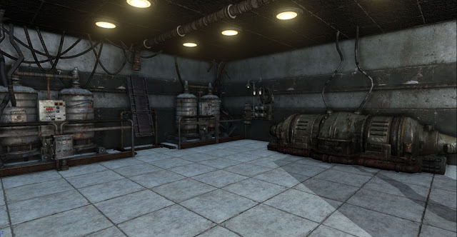
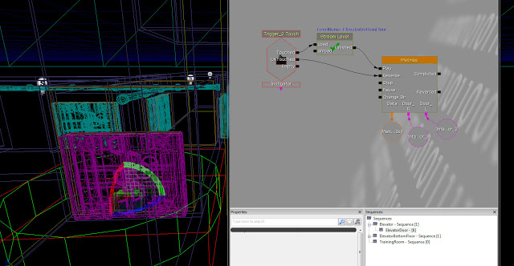
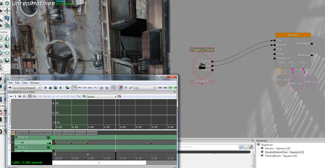

I have got the lighting set up in the level with static meshes also providing light. I have not yet built the lighting because I have not finished adding all the static meshes.  I have started populating the level with static meshes provided by the Unreal Development Kit, but I have not finished yet as I need to begin making 3D Models in Maya/3DS Max/Mudbox. These models will then be imported into UDK and will give a more unique feeling to the game as well as extend library of usable static meshes. Once I have created these models, I will come back to this level.

I have the first streaming setup done, it includes a trigger which will be activated when the player goes down the elevator. When triggered the next level will be streamed in and the doors will open. This is a good way to do it because there will be no loading screen to interrupt game play and the player should be oblivious to what has just happened. I still need to add a setup for unloading levels which the player is not present in, this will free up memory and thus boost performance.

The rooms in the level will be accessible by the player through doors, these have now been animated in Matinee and triggered using Kismet.

Here are the door animations triggered using Kismet and the level being streamed in. The lighting is not finished as lightmass would take too long to render.
