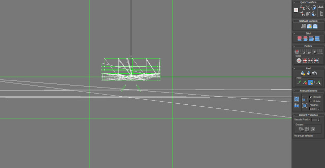

I have been working hard to finish this level, it is the most integral to the game and thus gains top priority. Some basic lighting and static meshes have been added to the level, I am still designing the obstacles the player will come across. Obstacles will include moving chains, lasers and toxic spills. The objective will be to navigate through the level while collecting items in order to escape the level. The next step is lighting the level with a combination of static and dynamic lighting.

The chain physics asset has been integrated into the level and used in conjunction with Physics Joint Actors to hang other meshes from them. I have also created the laser mesh and material.

I was having many problems with lighting the level in UDK due to SketchUp's limited UV editing support. I attempted to correct this in Autodesk Maya and create a separate UV for the lightmap but in the end I could not get the desired results.

This was before the UV's were modified but ultimately I decided to use the mesh as a reference and just build the level from static meshes and some BSP. I think this was a much better idea because changes can be made within the editor quickly.
