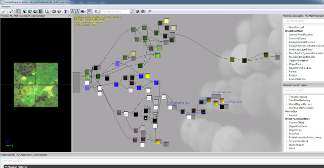
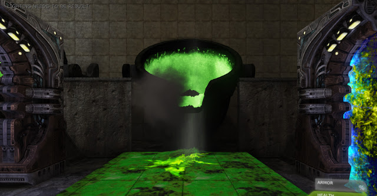
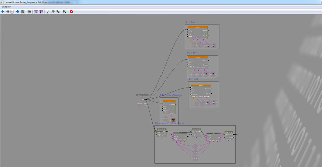

I am continuing to work on this level adding obstacles for the player to overcome. Here are the first few to be done.

This is the array of shock walls which turn off for a short period of time allowing the player to pass through without taking damage. The idea is that the player will observe them and try to get through, timing their entry. Incorrect timing will not kill them but do a medium amount of damage to encourage thinking about the obstacle rather than just running through.

The kismet to set this up was very simple, I used a thin plane to show the shock wall which is used as a visual indicator by the player, it is toggled off and on using kismet. The damage is done by a volume which is toggled off and on.

In order to implement this I created a material which resembles a force field style wall. It is mainly blue to allude to the fact that it could be electric and thus dangerous.

To make the shock-walls corridor more challenging I added acid pots that turn a part of the floor into an acidic pool. The pots move at the same time to not overwhelm the player but still ensure they think about how to pass without be killed.

Because the floor is safe sometimes but deadly when the pot is tilted down, I had tom create a material where I could toggle between the two states in matinee. I created a material with a parameter which is modifiable. I could then use a material instance constant and matinee to give a smooth transition between the states.

This is the acid pot tilting down causing the floor below to become acidic and deadly. Sound and particle effects are added to connect the two events; the pot tilting resulting in the floor becoming goo.

The kismet scripting was relatively easy however the timing for matinee had to be tweaked a lot so that sound effects and particle effects would align with other events in the scene. Again I use kismet to toggle a lava volume which will damage the player only when the floor is toxic.

This simple obstacle also requires timing, it is a guillotine which, if the player is not expecting it, is very dangerous. It slides down quickly and retracts slowly.

This was a very simple implementation which relies on matinee for animating the metal which slides down.

This is the first set of obstacles added, more variety will be added in the coming weeks which will add lasers which the player must dodge or may even follow them. There will also be items the player must collect to progress through the level and puzzles they must solve.
