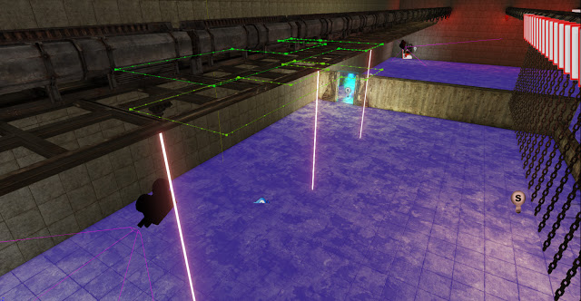
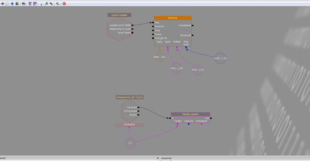

There are a variety of obstacles which are used throughout the level. The lasers follow a predetermined path set by Matinee and can move in complex paths. I also have used simple obstacles such as a trench which kills the player, it can be navigated by jumping over it or more safely, waiting for a platform to rise up to bridge the gap. The level has been divided into sections using barriers which can only be unlocked by switches. The obstacles are very simple and relatively easy to navigate however with the addition of a imminent danger like a bot, the player can become focused on killing the bot and therefore the obstacles become more dangerous.

  
I wanted to introduce an element of randomness so the lasers do not move at the same time but may have subtle difference. I used a random float variable kismet to add this randomness. With this I can modify the delay when the level starts or the play rate so the obstacles move at different speeds. I think randomness is important in a game so the player has variety when replaying.

Here is the opening part the assembly line after the player navigates through the offices. It shows off the barriers/obstacles and the cinematic sequence to show cause and effect.
