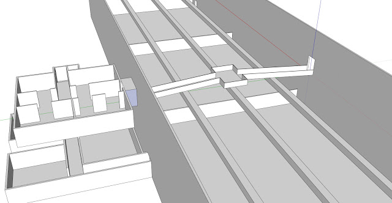

In order to get a rough idea of a level, I decided to experiment with making one using Trimble (Previously Google) SketchUp. I'ts quick and easy to use which means a rough idea can take shape very quickly allowing for it to be tested and modified much more quickly than pure BSP in Unreal. I have used Unreal Units when creating it so no scaling is required when it is imported into the editor. This level will ultimately be created using BSP or finished off in SkecthUp and broken up for level streaming. From here it will be populated with static meshs, particles etc to bring the level to life.

This takes place in an assembly line which the player will see over the catwalk, the 3 bars will be chains where robots are being assembled and moved down the line. This section will provide a puzzle/obstacle as they attempt to navigate through the moving maze in order to escape.

Here is it imported into UDK with a basic material applied:

<iframe width="560" height="315" src="https://www.youtube.com/embed/D1gCUSQx3QA" frameborder="0" allow="accelerometer; autoplay; encrypted-media; gyroscope; picture-in-picture" allowfullscreen></iframe>
