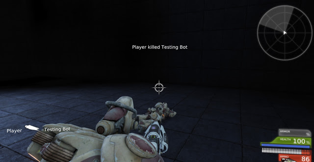
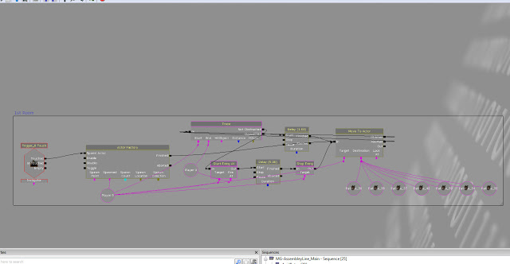

I have been finialising the levels of the game, this includes adding enemies to the levels which should challenge the player. To do this I used Kismet to spawn enemy bots on a trigger. They are able to spawn in different locations which I set. This adds variety to the game and ensures that there is an element of randomness which is designed to keep the player on their guard even when they think they know where the bots will be.

I was initially going to make the AI in UnrealScript but it took too long to test each iteration of the AI. I decided to go with Kismet which allowed for quicker iteration but is per level. This gave me more visual control however lead to some other issues. One issue was the that an Actor Factory is unable to spawn multiple enemies which can then be controlled with Kismet, to resolve this I had to make separate Actor Factories for each bot. The overall implementation is okay and serves it's purpose but in future I would like to improve the AI using UnrealScript. This would involve a lot more time than I have due to having to make animations and the implementation for a cover system for AI to utilize.

Here is an example of the AI working, I know roughly where they spawn and how they act because I designed them so the video does not show off their AI as much as them moving and shooting at the player.
