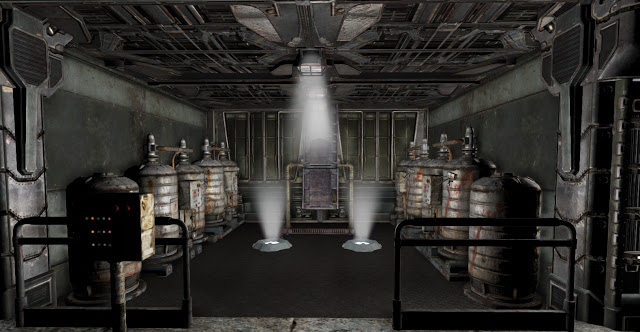
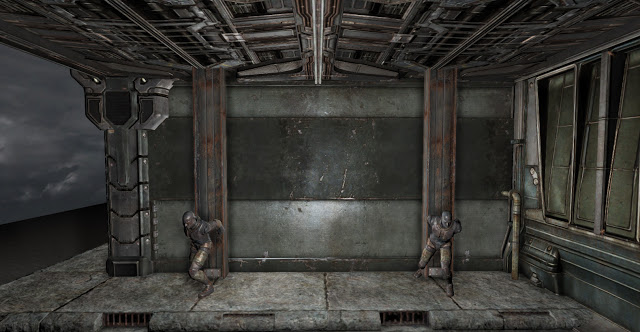
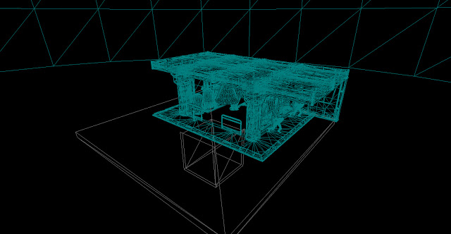

Here are some screenshots of the main menu level I am working on. This will be used for the game's main menu and will include camera animations which will transition depending on the Scaleform menu. The level is very simple so it will load quickly and contains an enclosed box below the level in which the player will be held. This will prevent the player being seen when in the menu and it will stop them from dying. The next stage is setting up the kismet and matinee.
