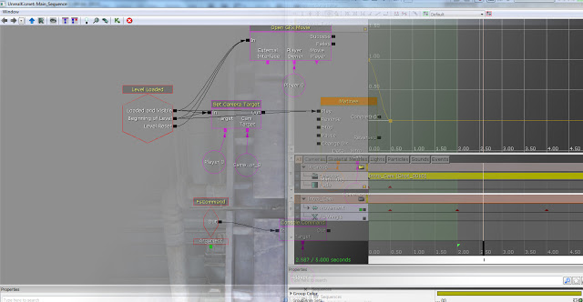
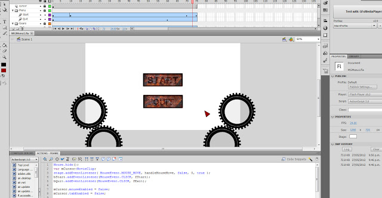
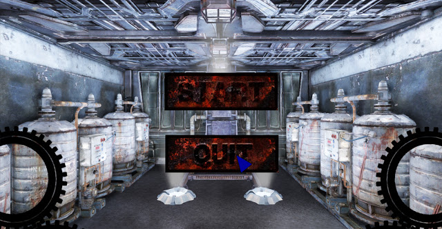

I have began trying out different buttons in Photoshop and Flash and have been working on camera animations. This basic menu is implemented with animated gears spinning and the camera moving animating. I now have a much better understanding of how Unreal Matinee works which will help me when creating the cinematics. These are not the final buttons and are just better tests - They will be used for now until I can come with something better.
