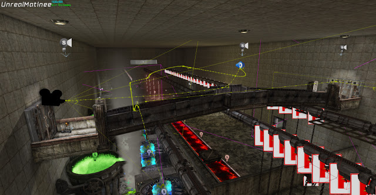
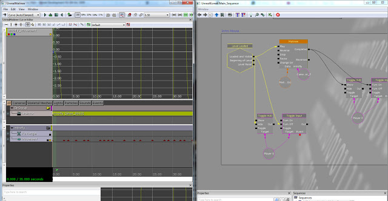

To allow the player to understand the level and how it flows I used Matinee to animate cameras throughout the level. This allows the player an overview or hint without directly telling them. I used this as an introduction to a level as well as showing that a player's action has effect in the game world. An example of this is a switch which opens a door, a sound plays to give a audio cue and the camera pans to show the barrier deactivate and thus allow the player through.

There are a number of cameras set up throughout each level, they are triggered either by the level loading in the case of the opening flythrough or triggered in the level due to a player's action. My kismet code restricts movement of the player and hides the HUD during these sequences to ensure the player does not die from attempting to continue to navigate the level.

Here is an example of the opening flythrough, The recording is a little laggy but this is due to the recorder as well as the game loading level assets at the beginning.
