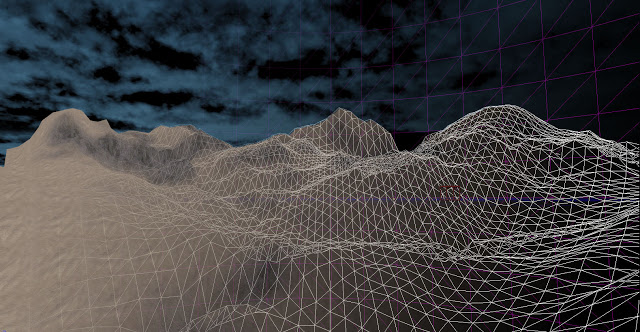
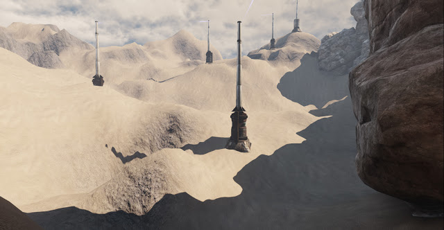
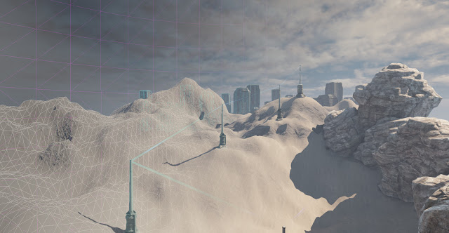

The basic terrain has been created for the level, it will be the area in which the player will escape the factory to. I had a few problems with setting this up in UDK due to it still being in beta, it crashed multiple times while editing the terrain.

I have added static meshes as well as a Dominant Directional light to light the entire map. The structures are power pylons which supply the factory with electricity.

The only things left to do now are basic collision creation to prevent the player from going outside of the map  and perhaps better integration with the other levels, I plan this to be much later in the game and therefore still need levels in between. I will need to begin play testing on different devices to see whether or not level streaming can be used effectively with terrain.
