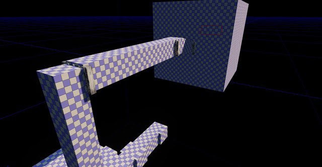
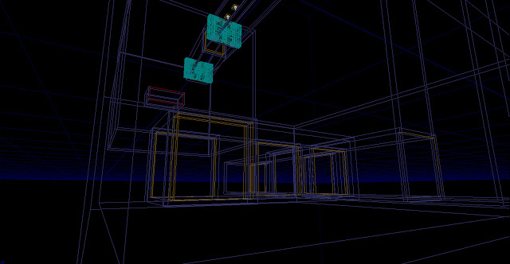
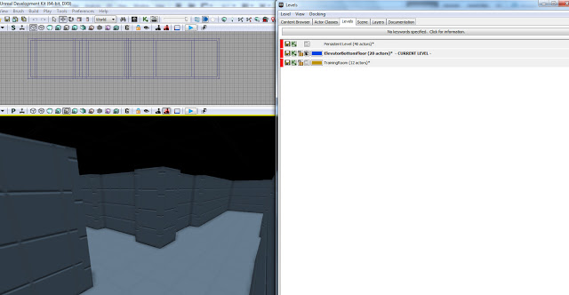

This will be the one of the first levels the player will encounter, it will be where the story is setup as well as the lead to the "Training Room" where they will be lead through a tutorial. So far I have the first BSP Layout which is the skeleton of the level. From here, Static Meshes will populate the world and textures will be applied to surfaces. Only in-engine assets will be used for now but more specialised static meshes or textures will be created once I know what exactly I will need.

I am also using Level Streaming for this area which is actually 3 levels so far. This will make it easier to work with in the editor as it will take up less memory and will benefit the user if they are on a lower range PC. I will setup the Kismet streaming later on which will stream the levels probably using triggers to give the best control.

The next stage will be adding static meshes and materials. This will be followed by lighting.
