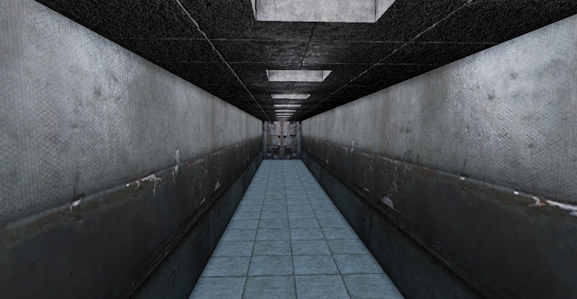
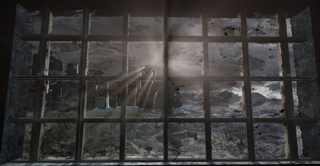
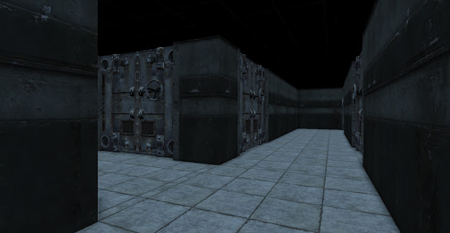
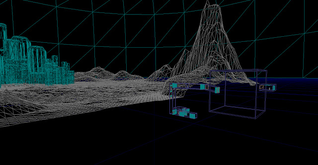

I have quickly gone over the level and added materials where needed. This will serve as the transition area between the beginning of the game and the "Training Room" where the player will take control for the first time.

The player will be able to see the outside early on in the game as the elevator goes down, it should allude to the idea of freedom that is barred from the player. It should also serve as a subconscious goal for the player to escape.

The lower chambers will be where the player begins, they will be transported to the elevator and then the training room afterwards.

Here is a wire mesh showing the terrain and the basic block out of the level in BSP. The training room (Cube) is empty now because I hope to have the room populated with dynamically moving objects, this will be done last as it is the most complex task. The next stage is to begin adding static meshes to the level.
