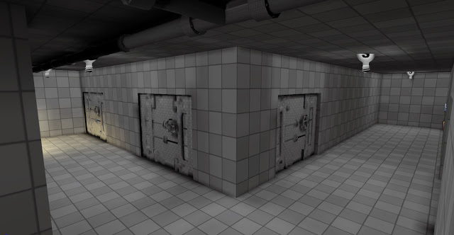
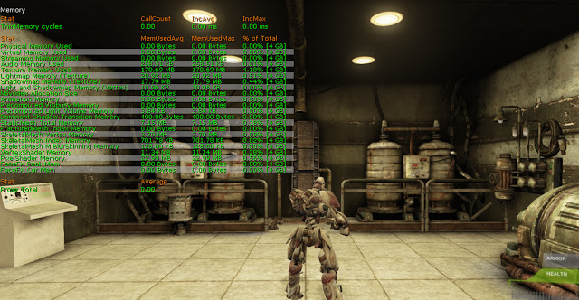
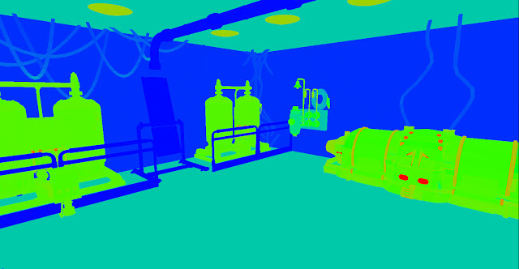
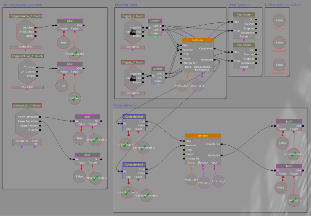

I have begun getting my levels ready for a working build, one which should be playable if deployed. This begins with finishing off existing levels and making sure they are ready to be built. The first level the player will encounter has been modified and lighting redone in parts, level streaming is now working throughout without the player noticing. There is still a lot to do such as music, cinematics and the actual gameplay in this level but it is playable, albeit 'no frills'.

One major problem was the amount of memory being used and stored in memory, somehow there was on average around 1GB of Texture Memory Used. This could prove a huge problem for lower end computers as it would leave barely anything for other elements of the game. To improve this I reduced the size of some of my larger textures which were using up a lot of memory. These were mostly located outside the playable area as scenery in the distance and therefore changing the size made no visual difference. Now I have managed to reduce the amount significantly with this map taking up below 200MB of texture memory.

Using UDKs built in tools to see lighting and texture density I am able to see where performance could suffer. By making sure there are not large areas of high texture density or complex lighting I am able to ensure the level runs as smoothly as possible.

A major addition to the level was sound and an elevator to go into the previously empty elevator shaft. To get the elevator working correctly I used matinee for animations and kismet to script the behavior. This simple thing took quite a long time and a lot of trial and error because the elevator has to be activated by the player getting into it, the doors should close before it moves and the whole setup should use minimal amount of animations. This is my final kismet graph for the elevator including player detection and sound.

Here is the level with the new additions and changes:

<iframe width="560" height="315" src="https://www.youtube.com/embed/AM62sCRKQ78" frameborder="0" allow="accelerometer; autoplay; encrypted-media; gyroscope; picture-in-picture" allowfullscreen></iframe>
