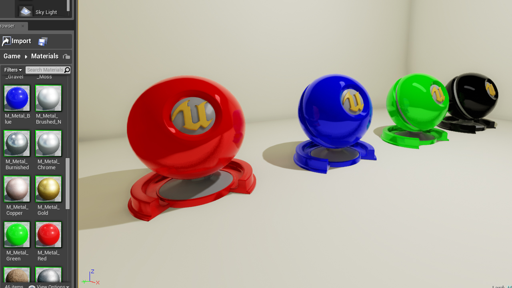
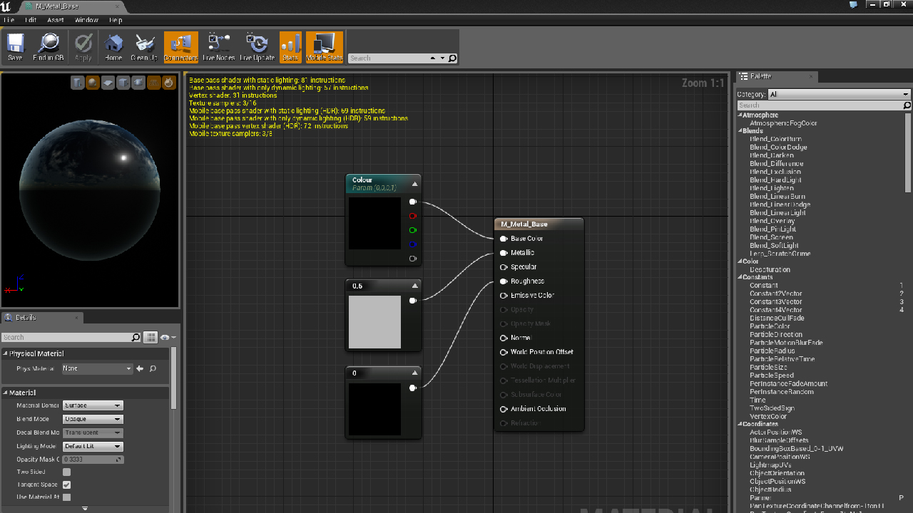

The material editor is now easier to use and thus it is very quick to make basic materials which look good.

These materials instances were created from a very basic base material which has a colour parameter. I can foresee the creation of more complex and better looking materials being much easier than with UDK in Unreal Engine 3. Even these materials with a texture applied for surface detail would could be usable at a later date.

