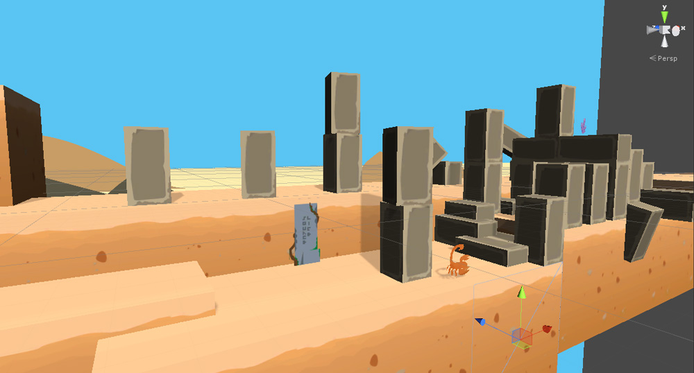

### **Working Prototype**

It was my first time using Unity but I was able to jump in and start experimenting. The ease of use and mostly intuitive nature of the engine and editor meant I was able to put together a working prototype in a few hours without any experience with the engine.

### Programming

Working with Unity provided some different challenges compared with working in UnrealScript UDK. Coding was relatively easy but getting to know how the editor and code interacts took time to understand. In the end, everything came together and scripts were created in C# for most features including salt throwing, player movement, camera movement, enemy AI and checkpoints.

### Level Design

The idea of the game was to have 3 Acts which look different from one another, although they were not fully realised due to time constraints, they are still distinct enough to add some interest and change the fell of the levels.

Below depicts a beginning level in Act 1

The levels are comprised of a 3D and 2D elements in order to have a definite ground for the player to navigate while maintaining the feel of a popup book; I handed in a popup book in conjunction with my proposal and wanted the theme to carry over to the final project.

These level show more focus on platforming, the player is able to move between Z planes much like Little Big Planet; there are 3 layers in which the player can move on.

Enemies can be incapacitated by using slat which can be found throughout the level. By clicking on an enemy a vine grows out of the ground, destroying the enemy.

These mining robots were intended to patrol looking for salt and thus provide a challenge to the player if they held more salt. This functionality was not implemented, the enemies are instead just patrol the level.

This is the ending of the level, upon entering the final checkpoint the camera will animate, panning around this temple-like structure before returning to the main menu.

### Project Management

In order to maintain deadlines, asset requirements and general collaboration between the team I encouraged the use of GitHub for version control which allowed for the game to be modified by everybody and revert any changes which proved to be game breaking. We also used Trello for collaboration and a Facebook group page.

The project is available at: [https://github.com/Darth-Knoppix/WithoutSalt](https://github.com/Darth-Knoppix/WithoutSalt)

### Conclusion

Overall this was a very interesting learning process, in the end the game had parts of what we initially wanted but many things were cut due to time constraints. I think this is a good representation of game design and development in the real world. There are so many great ideas which are though of but it all comes down to whether it works and whether there is enough time to implement it properly.

I think what I have learned though using Unity for an actual project is very useful, I can see how rapid development can be achieved with very little experience. I would like to make a personal project with Unity to see what I can do but UE4 is also an excellent engine and it is much cheaper to get started compared with the hefty price tag for unity pro.
