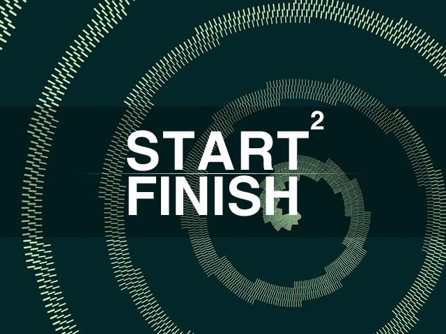

It has been almost a year since I last updated this blog. I have been preoccupied with University and a new job but I have wanted to continue developing small projects. I am starting a new project, I'm not sure how much time will be dedicated to it or if the blog posts will be as regular because I have less time than I once did. I will however do my best to make something functional and document the process I go through.

In this project I will be taking a break from UDK for a little while (I may still document small samples) and instead will be focusing on building a game closer to the ground up. I will be undertaking this using C#, the XNA framework and MonoGame. Although Microsoft is planning to discontinue XNA in April 2014, it is still useful and hopefully MonoGame will allow for support to continue. It will also allow me to port to other platforms if my project becomes something I want to develop fully.

This project will be different in many ways to the UDK project as I have less time and no deadlines which I hope will not degrade the quality of my documentation regularity. The project itself will result in a basic outcome but the development process will be more advanced as everything will need to be built from nothing. XNA will help facilitate low level graphics, sound and input but there is very bare-bones compared with UDK where anything is just a mod of Unreal.

I will start to plan out the game and learn more advanced C# as I go (I have experience with other languages which are translatable and know the basics).

Check back for my progress and wish me luck!

[http://www.monogame.net/](http://www.monogame.net/)
