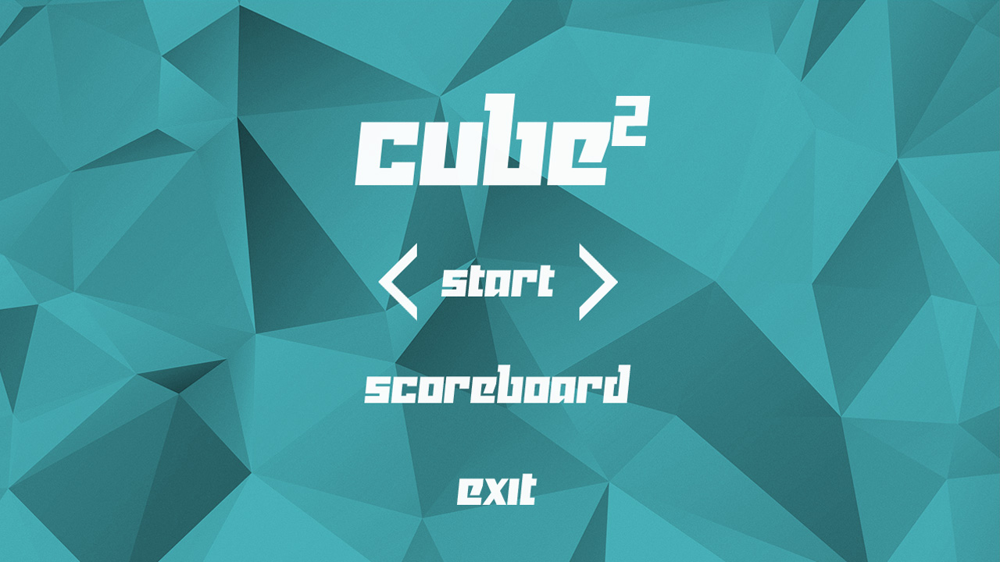
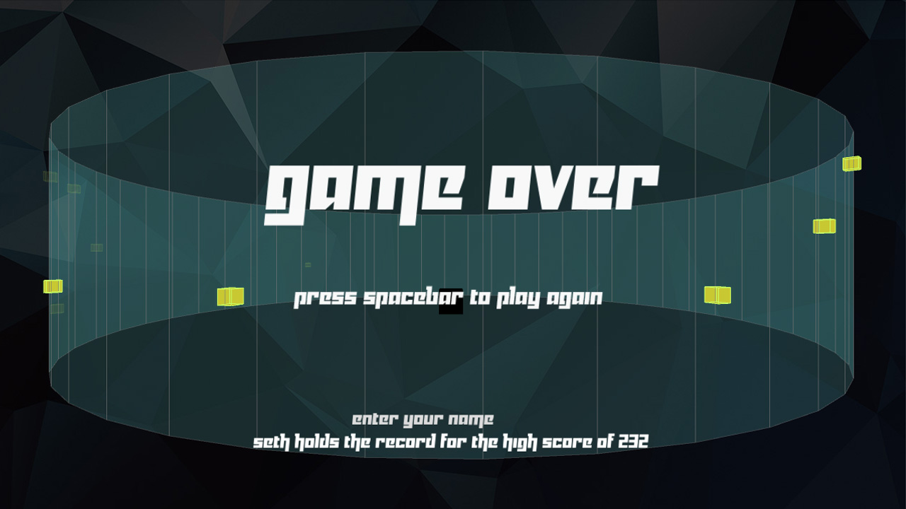
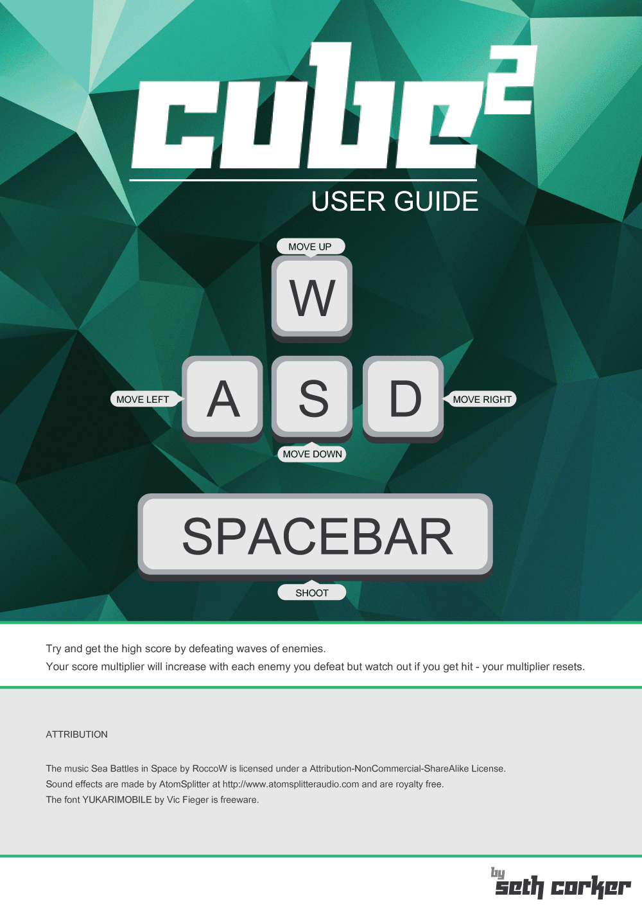
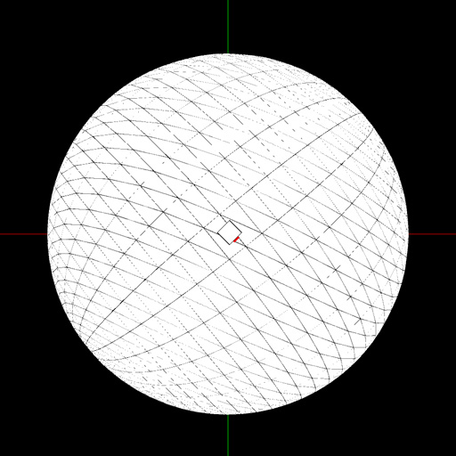

_This material was created while at the Victoria University of Wellington for a media design class._

This game was made for a media design project, it was created using [Processing](https://processing.org/) over a week. The player's goal is to amount a high score. It is a very basic shooter which was inspired by the recent Playstation 4 game [Resogun](https://www.housemarque.com/games/resogun/). It was a fun exercise with the main intention of practising quickly implementing existing game types.

If the player achieves a high score then it is added to a scoreboard which is saved to the hard drive.

I made it so the difficulty would increase as time goes on and the player becomes more skilled. This was done with a global float variable which is multiplied by enemy health, score awarded per kill and enemy spawn rate. A side-effect of this is that if the player will start off easy regardless of personal time played. If this system was implemented in an actual project I think it be interesting to attach it to a player profile - the number would decrease if the player had not played the game in a long time - this would allow the player to re-familiarize themselves with the mechanics and difficulty.

As part of the handin requirements, a user guide was required.

This project began initially as a study of another of [Housemarque](https://www.housemarque.com/)'s games, [Super Stardust HD](https://www.housemarque.com/games/super-stardust-hd/) which has a similar mechanic however it allows the player to move around a planet. I managed to implement the player rotation and orientation but I was unable to have the player shoot in the correct direction within the time which was given. The project was then changed slightly to remove the difficulty with working with the X and Y axis in Processing.

I would like to explore this idea for other game types in the future but it requires more effort and a good understanding of quaternions.

[Google+](https://plus.google.com/114747953941684908698)
