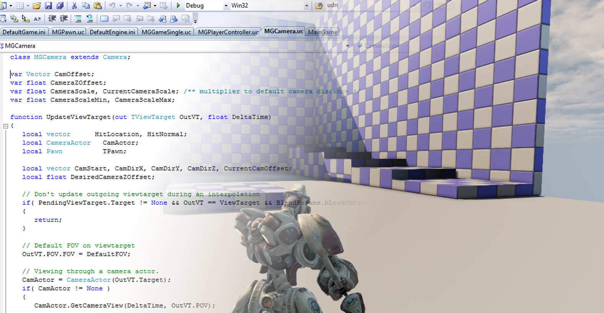

This is the first camera setup I am trying. It is a very basic implementation using Unrealscript. It gives very good results with only minor issues such as there being no limit for looking up and down. It would be good to limit the camera from looking too low or too high. Other than that it has collision which prevents the camera from going outside of the level.

I will try other camera systems and compare them but so far this is a simple but elegant solution.  
It is available [here](https://udn.epicgames.com/Three/BasicGameQuickStart.html) through the Unreal Developers Network.

Here is it in action:

<iframe width="560" height="315" src="https://www.youtube.com/embed/WB25BvzfFYc" frameborder="0" allow="accelerometer; autoplay; encrypted-media; gyroscope; picture-in-picture" allowfullscreen></iframe>
