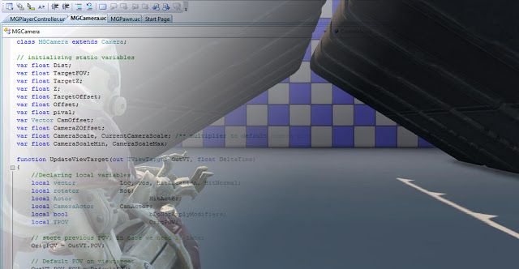

This is another camera set-up with some improvements and disadvantages over the previous one. It allows the player to zoom in by right clicking and when the player dies, the camera does not snap to their position like in the previous set-up. The main disadvantage I have with this implementation is that it intersects the player pawn which is very bad. A combination of the two implementation's could render the best results so far.

The code was modified from [here](http://romerounrealscript.blogspot.co.nz/2012/01/camera-class-unrealscript.html).

Here it is in action:

<iframe width="560" height="315" src="https://www.youtube.com/embed/VqC1iEK0hAU" frameborder="0" allow="accelerometer; autoplay; encrypted-media; gyroscope; picture-in-picture" allowfullscreen></iframe>
