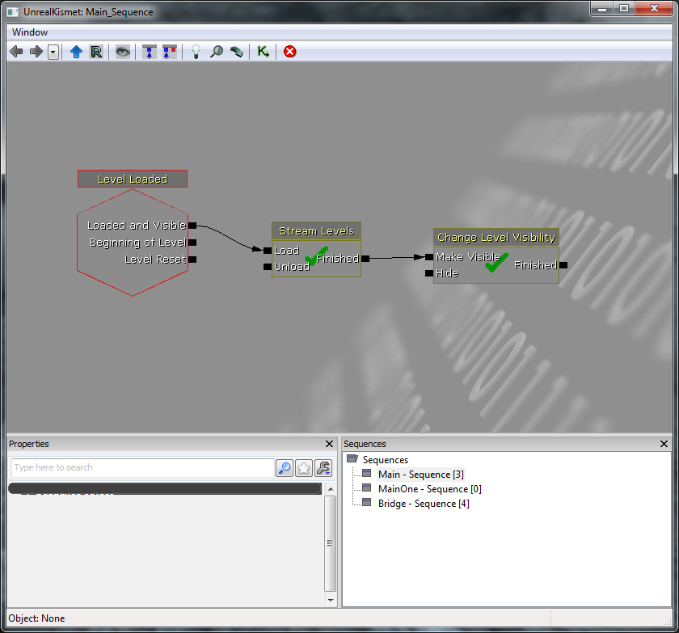

I am now testing different elements which may be included in the game. Level streaming is useful because it allows different levels to be loaded and the player to access them without having to wait through a loading screen. To illustrate this I have shown a level being streamed in which can be seen by the player but usually it would be hidden behind a door or corner.

To achieve this I used Kismet rather than Unrealscript because this it is much easier when using more levels. This technique can also be used for generating an element of randomness. I can have multiple levels available, when the player progresses a level will be selected at random and streamed in thus resulting a new experience each time and added re-playability.

Here is it in action:

<iframe width="560" height="315" src="https://www.youtube.com/embed/U6YdAGyZNuA" frameborder="0" allow="accelerometer; autoplay; encrypted-media; gyroscope; picture-in-picture" allowfullscreen></iframe>
