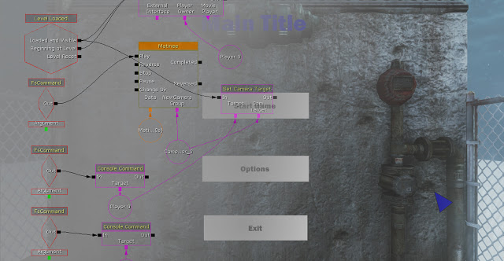

This is a very basic implementation of a main menu in Scaleform. It works well and is easy to make, with proper graphics this could be very good. It allows for an options menu and camera fly throughs which will make the menu much more immersive than just a static 2D image. This of course is just a quick implementation with graphics used primarily to test. The final graphics will be made with Photoshop and include animation such as rotating gears to fit with the style of game.

Here is it in action:

<iframe width="560" height="315" src="https://www.youtube.com/embed/G4PhdHGG7dY" frameborder="0" allow="accelerometer; autoplay; encrypted-media; gyroscope; picture-in-picture" allowfullscreen></iframe>
