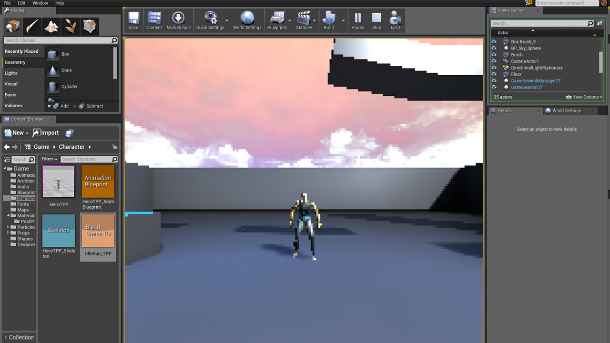

The aesthetic of an indie game is very different to that of a big-budget AAA game, where a big-budget studio may be concerned with photorealism in graphics, an Indie will have financial, technical, artistic  or other constraints which dictate the overall look and feel of the game. Although graphics are one of the most noticeable improvements in Unreal Engine 4, I didn't have time to create high resolution realistic looking characters or models as well as materials which realistically react to light etc. I had limited time to focus on art assets and so in order to combat this I looked at how I could choose a stylistic art direction which would save me time.

I chose to give my game a more retro look, this is often chosen by indie's for similar reasons, it is quicker to iterate over and manage 2D sprites than it is high resolution 3D models and textures. I created a post processing filter similar to the one descried by Epic Games [here](http://youtu.be/GLJC1qG3oK4). I made some modifications which allowed me to change the level of pixilation while the game was running as well as corrected for the default screen resolution.

The effect can be seen here.

