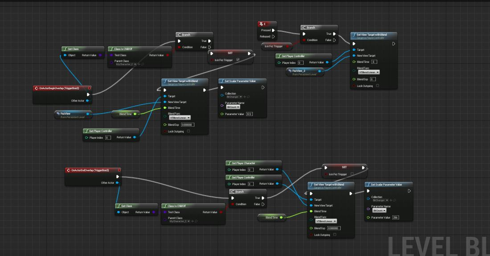

My platformer is being used as my presentation so I decided to include traditional slides with the game.

To do this I created meshes to hold a slide material and created cameras at the potions I needed to take up most of the screen.

When the player enters a trigger, the player controller will change view targets and blend between the player and the camera. I used this quick technique throughout the level to add hints to the player as well as show the slides.

This level blueprint controls the trigger as well as a slide change using the 'E' key if the player is still on the trigger.

