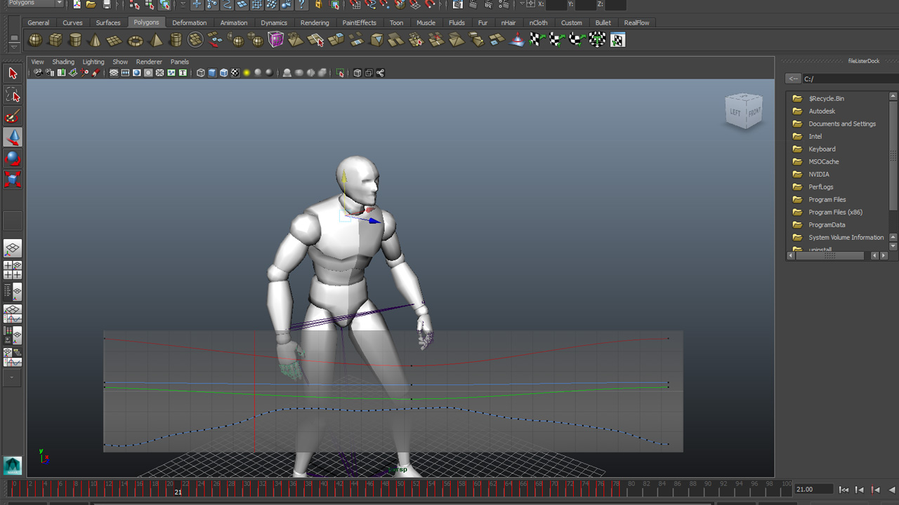
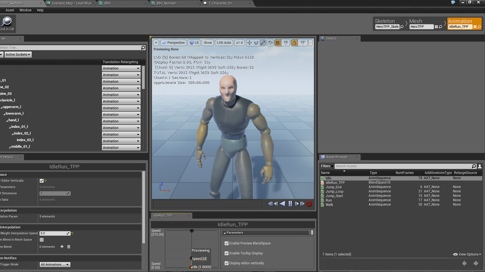

When the entire screen is a lower resolution due to the post processing effect, the player's idle animation is too subtle to be noticeable. In order to emphasise the chest and arms moving up and down as the character breaths, I decided to change the animation and exaggerate it.

I exported the original animation as an FBX which allowed me to import into Maya. I then modified the key frames and re-splined due to the animation being baked in.  
The graphical result can be seen below.

Once the animation was completed and imported back into the engine, I checked it worked and viewed it with the final post processing effect applied. The character's movement is much clear to distinguish than before.

