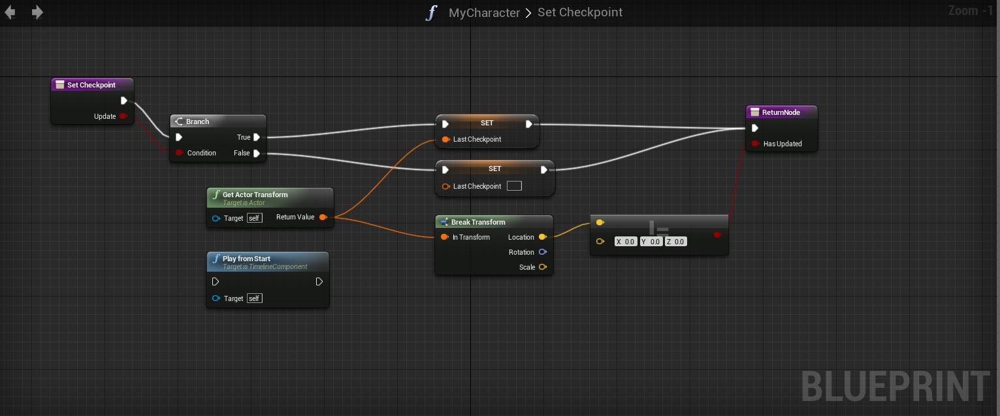
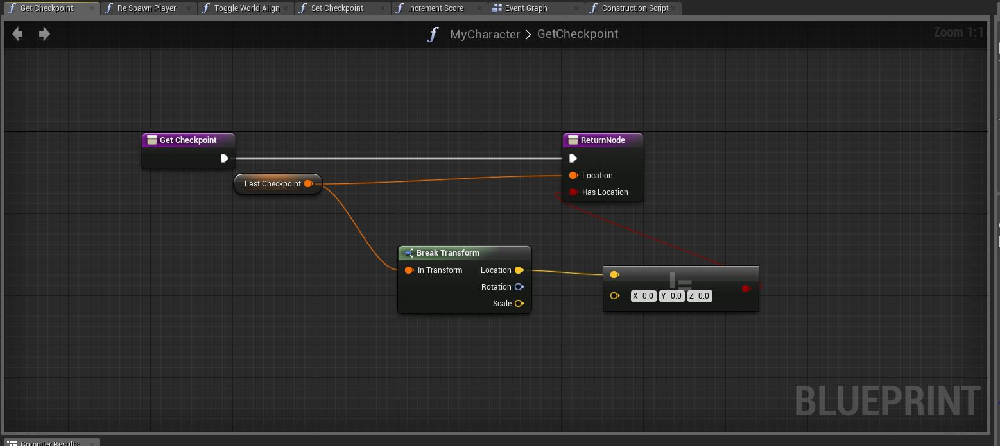
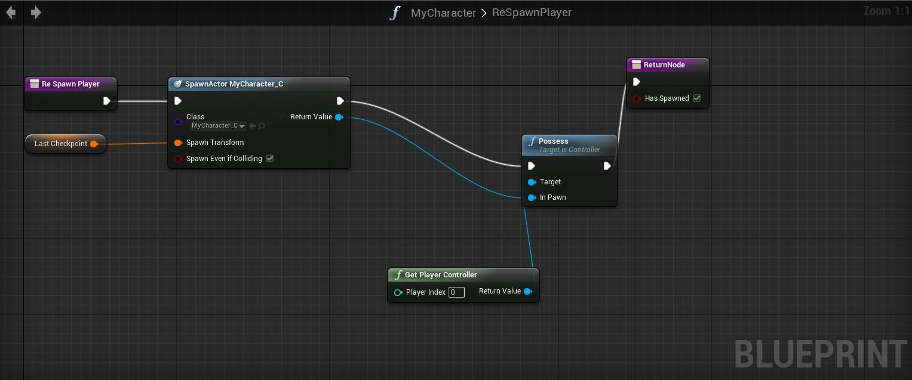
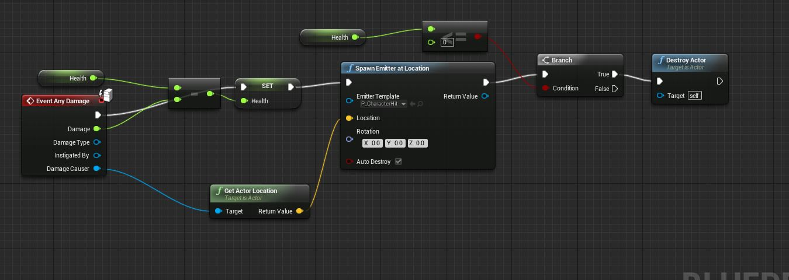
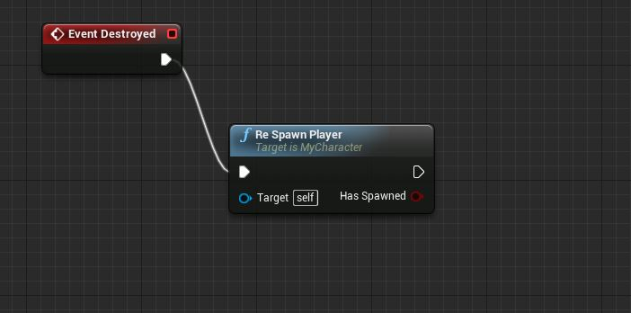

I created a checkpoint system using blueprints in UE4.

These simple functions in the player character class allowed a checkpoint blueprint to be placed throughout the level which would act as a point for re spawning the player.

This code destroys the old pawn and creates a new pawn at the last checkpoint location before possessing it.

A health system was not setup by default so I set one up to allow the player to be damaged and killed.

Another simple event is linked to when the pawn is destroyed to ensure they are respawned.

