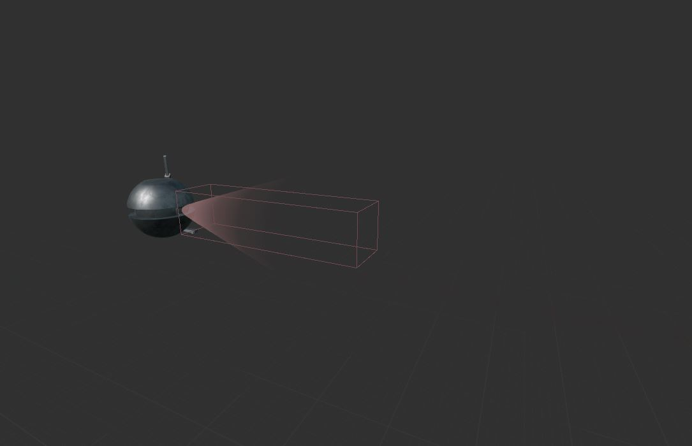
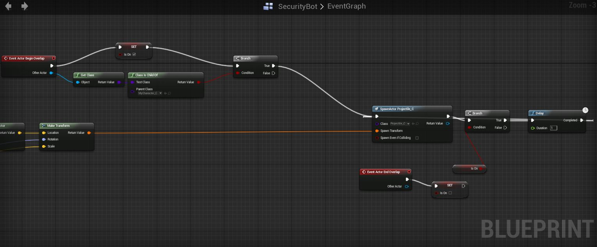
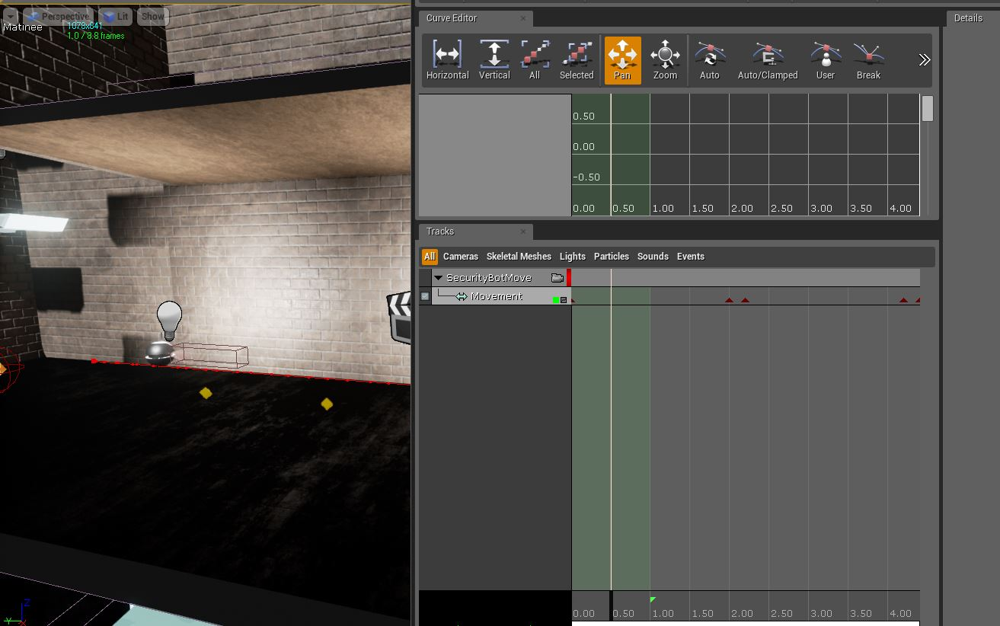

To have a simple obstacle for the player, I modelled this security bot and created a blueprint to allow it to sense the player and shoot at them.

The mesh itself is accompanied by a box primitive used for detecting overlap events. If the player is with the box then the bot will fire a projectile.

The movement of the bot is dictated by a simple matinee animation, ideally it would be defined through the blueprint itself however I did not have sufficient time to come up with a basic AI.

