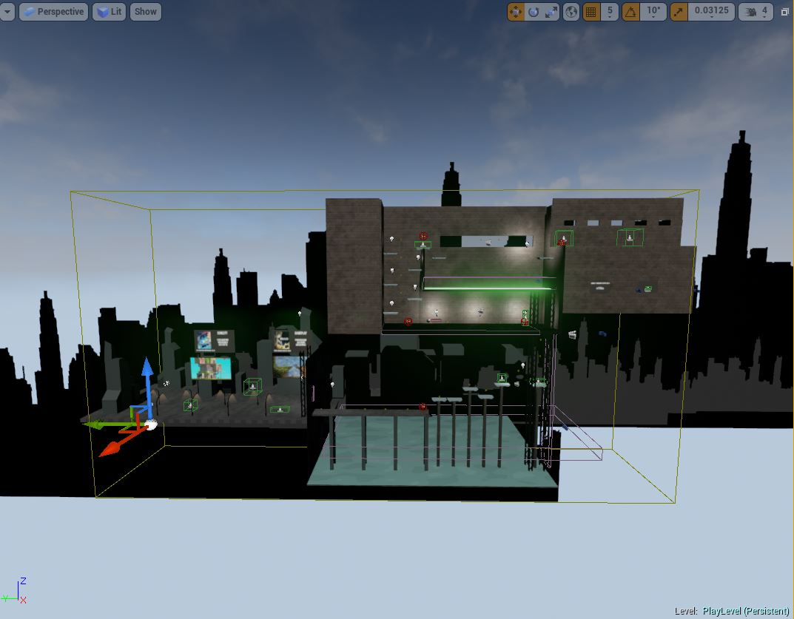
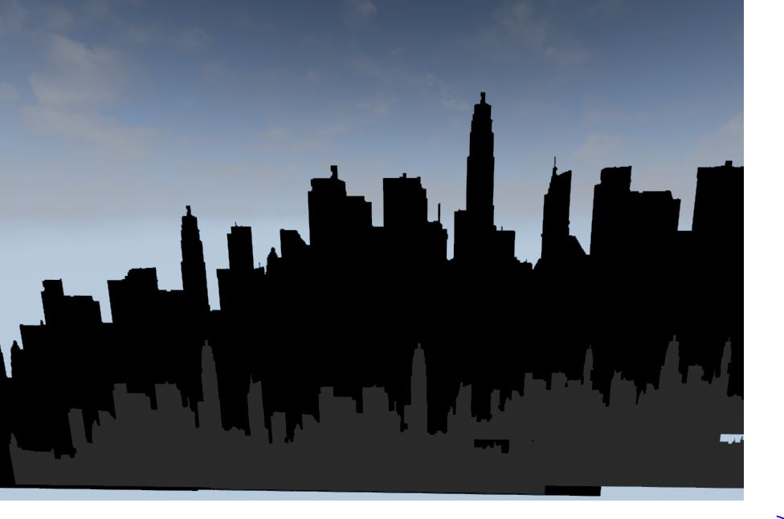
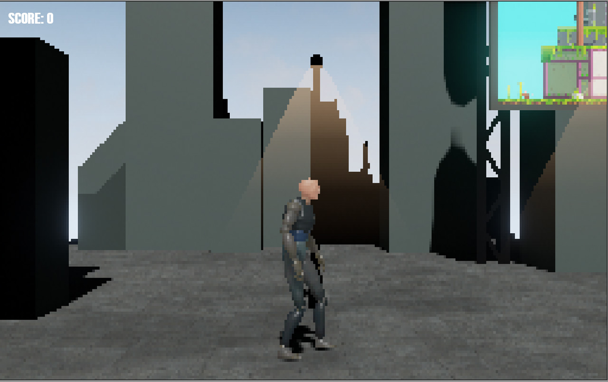

Due to the 2D nature of my game concept, the level can be created more quickly because of limited movement in the Y and Z axis. To have a parallax effect however I did make the level more 3D than it needed to be.

An example of this is a silhouette of a city which has been applied to a plane and repeated in the distance. This gives a nice effect of the city moving slightly in the background while the player moves.

The final look of the game can be seen here with a street lamp in the background as well as the city just visible in the distance.

