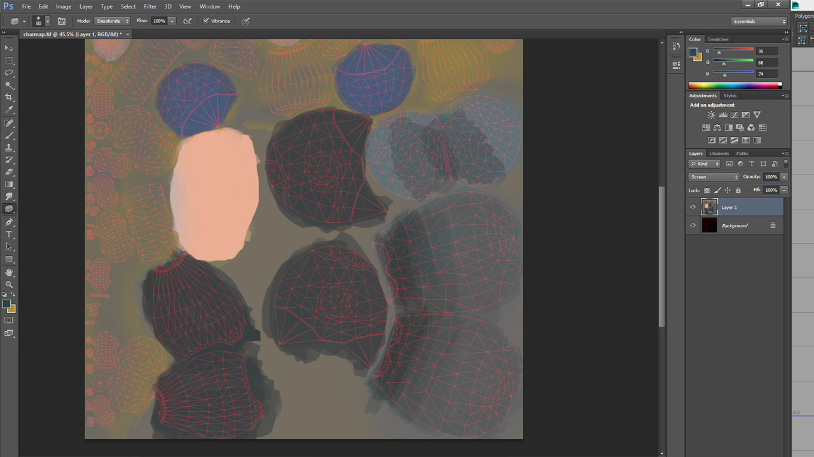
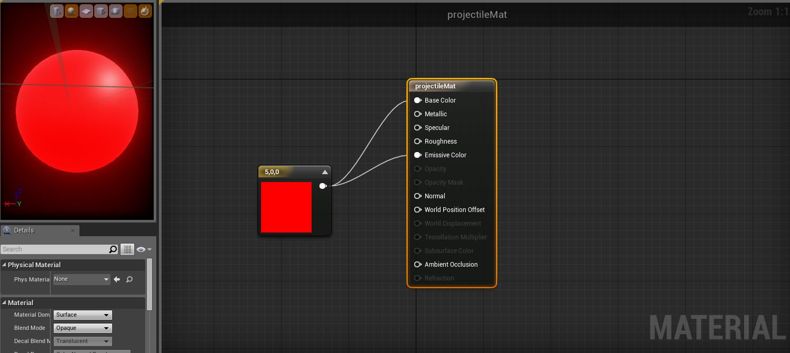

The materials I used throughout this project are either built-in to UE4 content by default or simple materials created by me. The process of creating complex shades/materials is a long one, it can take a lot of tweaking to get realistic effects however because of my art direction this process was reduced significantly.

The character is just blocked out colours which looks okay with the post processing applied, it defines the character more.

An example of the a material created for a projectile, the amount of detail which the post processing effect renders means than almost any effect will render similarly.

