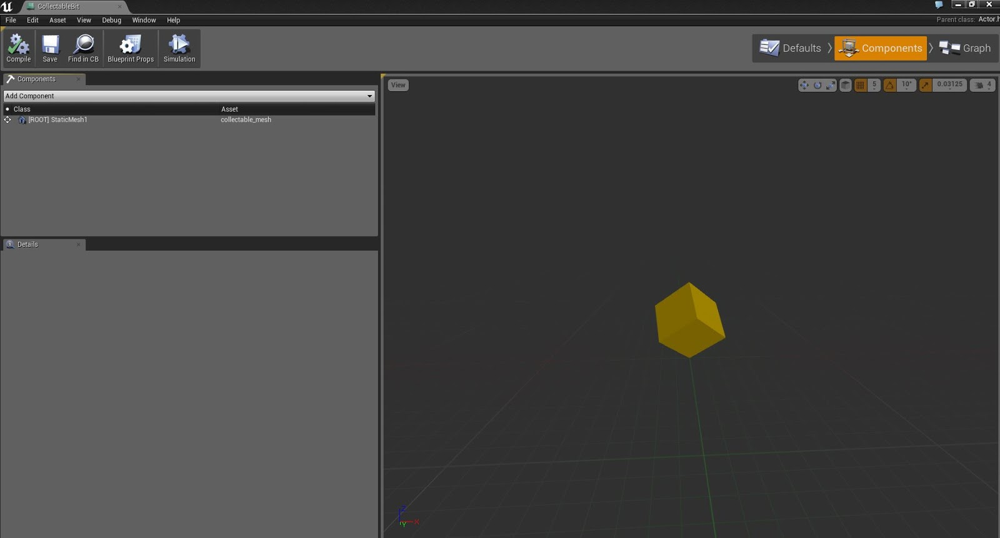
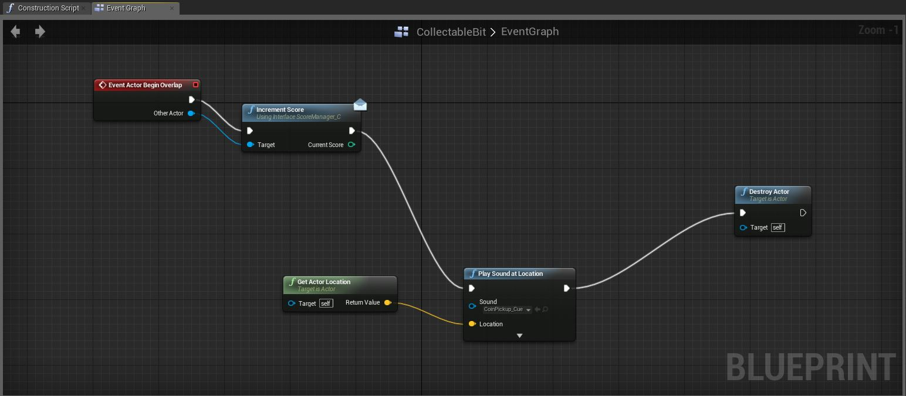
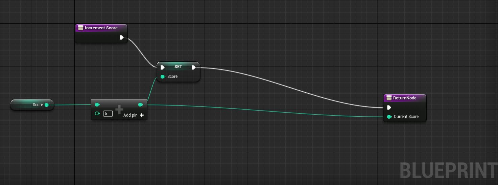

The blueprint editor which replaces Kismet is much more powerful than its predecessor, it allows for the entire game to be made without the use of C++ which is beneficial for me as I do not understand the engine enough to be able to dive into C++ straight away.

In order to create a collectable I created a mesh and applied a material which rotates the mesh, a blueprint was then created to hold this collectable.

The scripting itself was not difficult however understanding how the new blueprint system works made it more challenging as objects cannot directly communicate with each other effectively without the use of a blueprint interface.

The collectable/pickup needed to communicate with the player character to store the total score so an interface needed to facilitate the global function to allow this.

The collectable has the following blueprint.

The increment score function is implemented by the player character.

