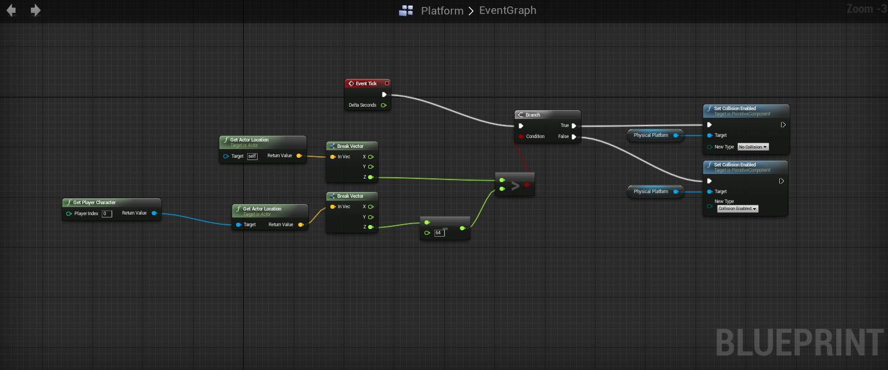

A key feature for my platformer was a platform which the player can jump through while still being able to land on.  To facilitate this I created a custom blueprint from my original platform mesh, the platform checks if the player is above it and if so then allow collision otherwise don't.

