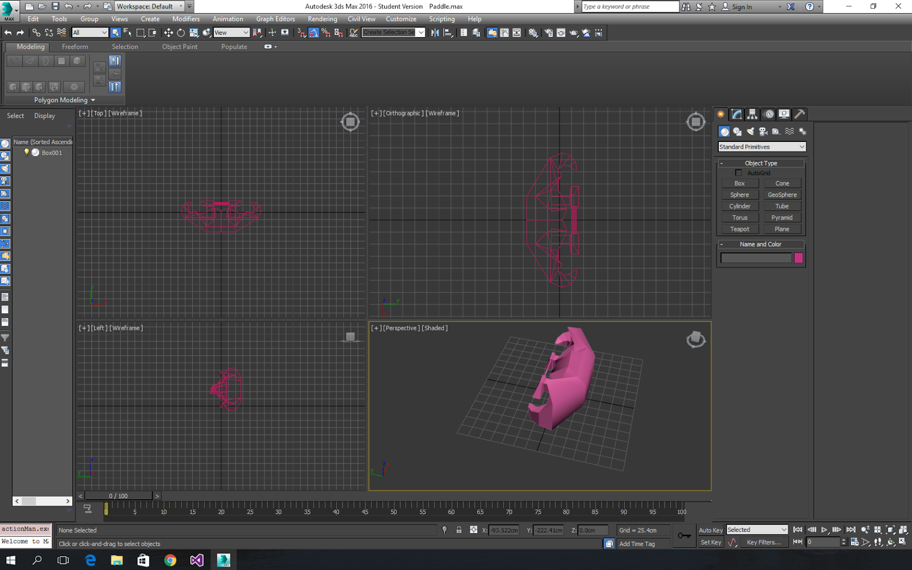
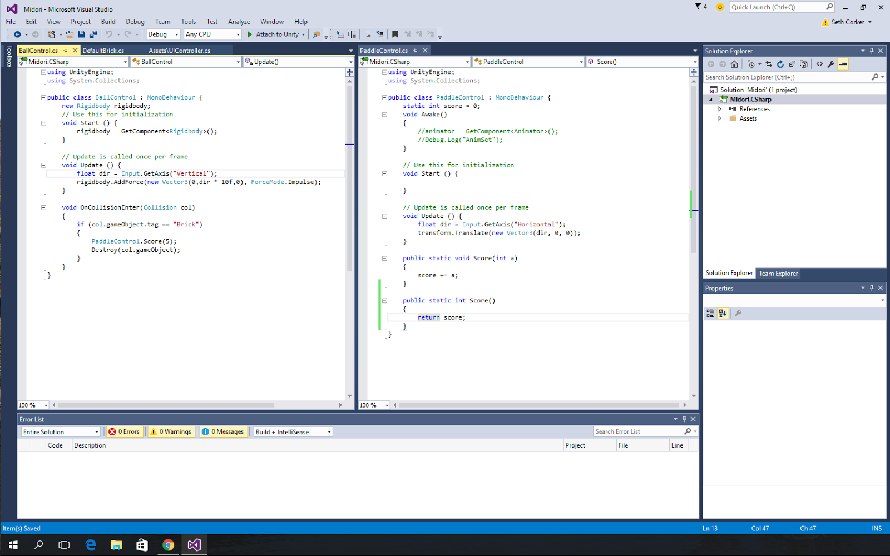
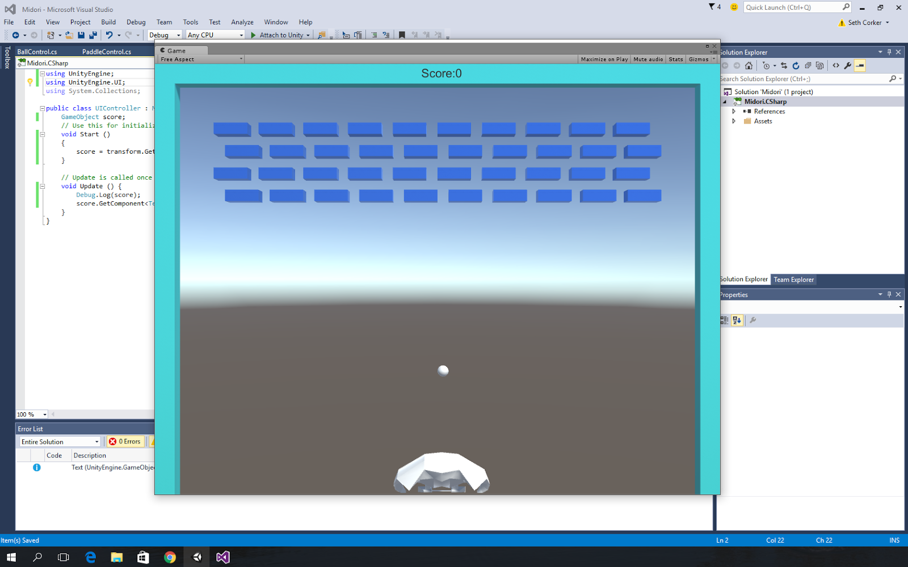
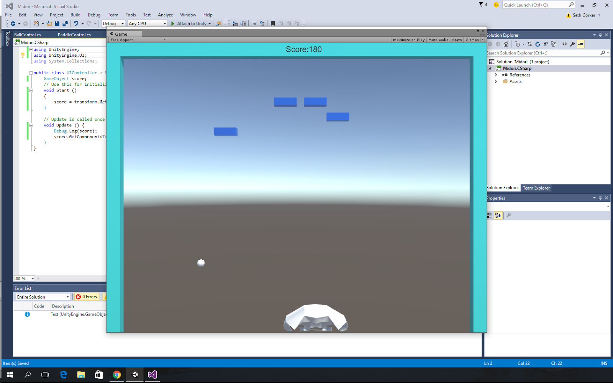

I am slowly acclimatizing to the Unity5 workflow and how some of the new tools work. I decided to try and get a basic game working and build on top of it. For this first project I decided a breakout game would be simple enough to make quickly and I could then look at expanding its features.

I was having some issues getting used to 3DS Max after such a long absence but I got my hands dirty and looked at a refresher video. Some tools in 3DS Max make it very fun to model in compared with Maya, it is not necessarily better but some things can be achieved more easily.

A basic level was created to facilitate testing basic features and mechanics of the game.

Scoring works and can be easily updated depending on the brick type (At this stage there is only one but I envision different bricks, some of which will react to physics and will require more than a single hit)

I added a way to have some control over the ball which will definitely be modified slightly to only allow push/pull of the ball when it is close to the paddle but for now it works. It is a similiar concept to that of the game Shatter by Sidhe Interactive which was release as a PSN game for PS3. This control over the ball as well as the sloped edges of the paddle makes the game less frustrating when there are less bricks left.
