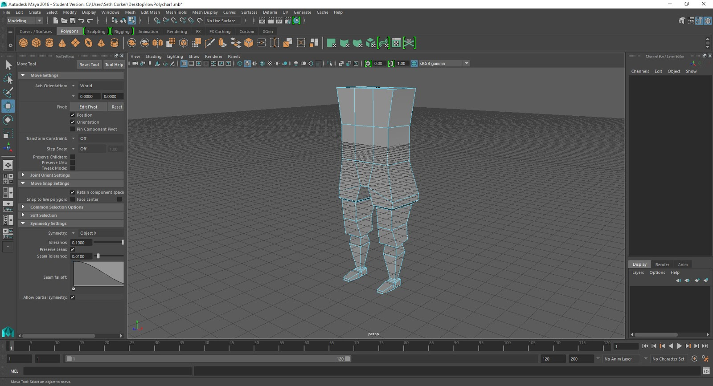
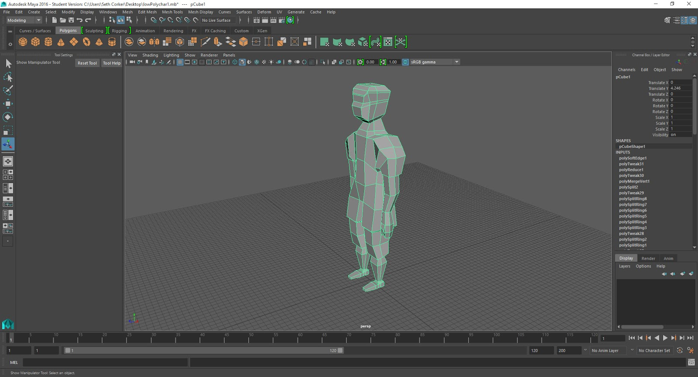
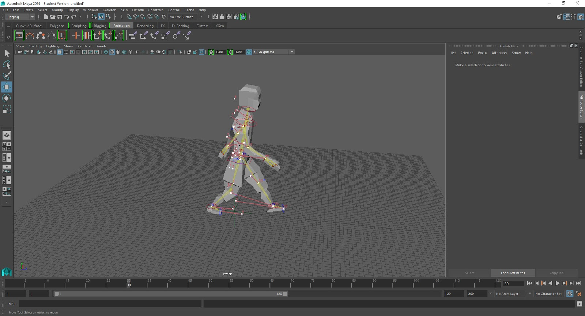
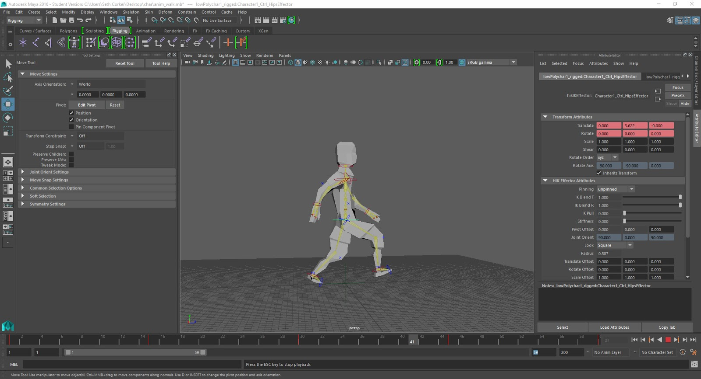
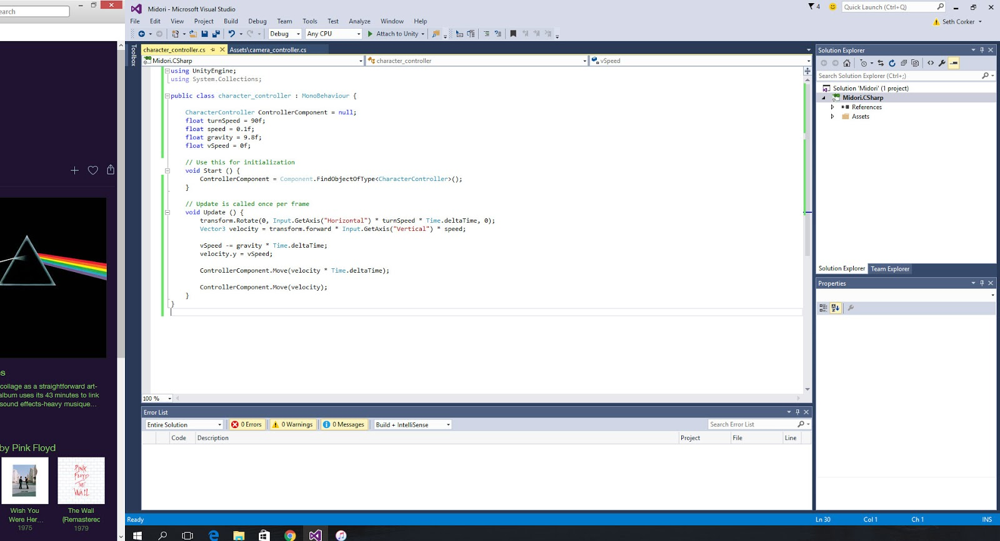
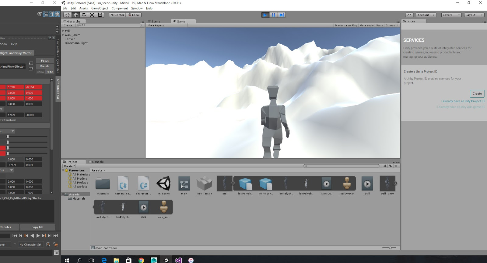

I am looking utilizing Unity again for another project, I thought I would have a look at some of the new features in the latest edition; Unity5 as of this post. I decided to get something going quickly and re-familiarize myself the tools I'll be using throughout the project.

This involved using Autodesk Maya 2016 for modelling a basic character, I initially attempted to create something with 3DS Max which I haven't used since my UDK project a few years ago. It proved too difficult to use due to the significant changes as well as the retraining I did for Maya in university.

I stared off with a cube and slowly built out using multiple extrudes.

This is the basic low-poly humanoid character ready for rigging.

After some pretty rough rigging I have started to animate the character's walk cycle. The weight painting isn't very good but it is sufficient to get used to the workflow from external 3D modelling programs to Unity.

The walk cycle has been completed and is ready to be exported as an .FBX and imported into Unity. There were a few issues getting used to how Unity's animation systems and workflow works but I got it working quickly enough.

I quickly put together some code to get the character moving through the scene.

The final character moves through the scene, I managed to create a lot of unnecessary junk in the process of testing however.

This task has a been good to go through in order to retrain myself in using Unity again and try to anticipate problems which could appear in the larger project.
