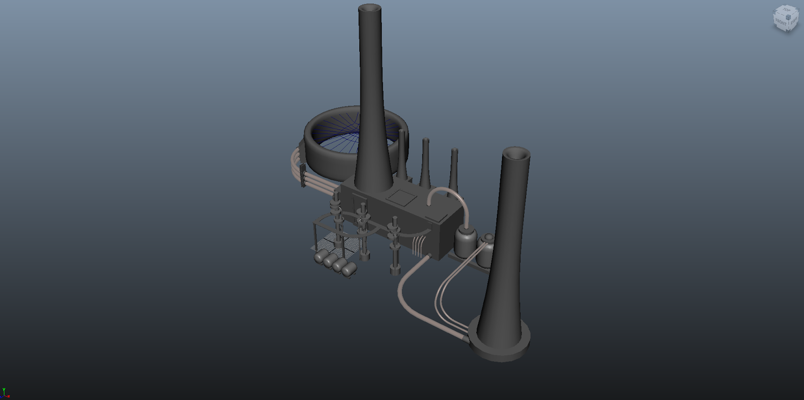

_This material was created while at the Victoria University of Wellington for a media design class._

I wanted to have this as a brief establishing shot to show where the actions are taking place which is within a chemical factory. This scene was never used in the final project.

