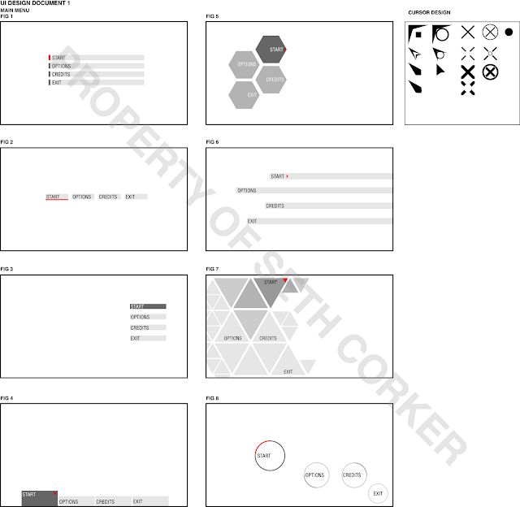

I have been experimenting with different designs for the main menu and possible cursors. These layouts will be refined and modified to make an in-game menu also. These are all more clean types of design which contrast to my original ideas of making a more rustic and 'solid' menu. These designs reflect a more computerized menu which could be interpreted as accessing a computer or the player in the game.  
The next step will be to choose some possible designs and develop them further so they can be made in Photoshop and a final menu can be created with Scaleform.
